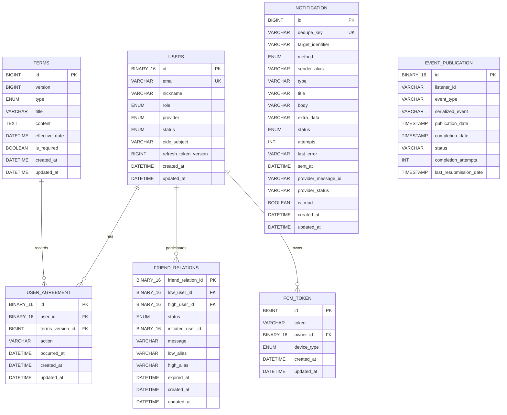

- 이 문서에서는 `ImHere` 백엔드에서 실제로 사용하는 데이터베이스 구조를 설명합니다.
- 다루는 내용
    - `JPA Persistence Entity`와 실제 테이블 매핑
    - 테이블 간 관계와 `Foreign Key`
    - `UNIQUE` 제약과 중복 방지 수준
    - 조회 목적별 `Index`
    - 삭제 동작과 개인정보 보관 상태
    - Outbox·Event Publication·Processed Message 구현 여부
- 참고 문서
    - 도메인 개념과 비즈니스 규칙: domain.md
    - 서버 모듈·트랜잭션·이벤트 구조: imhere-architecture-final.md

---

# 프로젝트 DB 설정

- 사용한 `DBMS` : `MySQL`
- 기본 DB: `rati`
- 연결 값: `DB_HOST`, `DB_PORT`, `DB_NAME`, `DB_USER`, `DB_PASSWORD`
- 초기화 기준: `db/init/mysql/imhere-full-init.sql`

```yaml
#application.yaml
spring:
  datasource:
    url: jdbc:mysql://${DB_HOST:localhost}:${DB_PORT:3306}/${DB_NAME:rati}
    username: ${DB_USER:root}
    password: ${DB_PASSWORD:}
    driver-class-name: com.mysql.cj.jdbc.Driver

  jpa:
    hibernate:
      ddl-auto: validate

  sql:
    init:
      mode: never

  application:
    name: imhere
```

### 초기 생성 SQL

```sql
DROP
DATABASE IF EXISTS {DATABASE_NAME};

CREATE
DATABASE {DATABASE_NAME}
    DEFAULT CHARACTER SET utf8mb4
    DEFAULT COLLATE utf8mb4_unicode_ci;

USE
{DATABASE_NAME};

SET
time_zone = '+09:00';

SET
FOREIGN_KEY_CHECKS = 0;

DROP TABLE IF EXISTS user_agreement;
DROP TABLE IF EXISTS friend_relations;
DROP TABLE IF EXISTS friend_relationships;
DROP TABLE IF EXISTS friend_restrictions;
DROP TABLE IF EXISTS friend_request;
DROP TABLE IF EXISTS notification;
DROP TABLE IF EXISTS fcm_token;
DROP TABLE IF EXISTS event_publication;
DROP TABLE IF EXISTS terms;
DROP TABLE IF EXISTS users;

SET
FOREIGN_KEY_CHECKS = 1;

CREATE TABLE users
(
    id                    BINARY(16)                                         NOT NULL,
    email                 VARCHAR(255) NOT NULL,
    nickname              VARCHAR(255) NOT NULL,
    role                  ENUM ('NORMAL', 'ADMIN')                           NOT NULL,
    provider              ENUM ('KAKAO', 'GOOGLE', 'APPLE')                  NOT NULL,
    status                ENUM ('PENDING', 'ACTIVE', 'BLOCKED', 'WITHDRAWN') NOT NULL,
    oidc_subject          VARCHAR(255) NULL,
    refresh_token_version BIGINT       NOT NULL DEFAULT 0,
    created_at            DATETIME(6)                                        NOT NULL,
    updated_at            DATETIME(6)                                        NOT NULL,
    PRIMARY KEY (id),
    UNIQUE KEY uk_users_email (email),
    UNIQUE KEY uk_users_provider_oidc_subject (provider, oidc_subject),
    KEY                   idx_users_nickname (nickname)
) ENGINE = InnoDB
  DEFAULT CHARSET = utf8mb4
  COLLATE = utf8mb4_unicode_ci;

CREATE TABLE terms
(
    id             BIGINT       NOT NULL AUTO_INCREMENT,
    version        BIGINT       NOT NULL,
    type           ENUM ('SERVICE', 'PRIVACY', 'LOCATION', 'MARKETING') NOT NULL,
    title          VARCHAR(255) NOT NULL,
    content        TEXT         NOT NULL,
    effective_date DATETIME(6)                                          NOT NULL,
    is_required    BIT(1)       NOT NULL,
    created_at     DATETIME(6)                                          NOT NULL,
    updated_at     DATETIME(6)                                          NOT NULL,
    created_by     VARCHAR(255) NULL,
    updated_by     VARCHAR(255) NULL,
    PRIMARY KEY (id),
    UNIQUE KEY uk_terms_type_version (type, version)
) ENGINE = InnoDB
  DEFAULT CHARSET = utf8mb4
  COLLATE = utf8mb4_unicode_ci;

CREATE TABLE user_agreement
(
    id               BINARY(16)   NOT NULL,
    user_id          BINARY(16)   NOT NULL,
    terms_version_id BIGINT      NOT NULL,
    action           VARCHAR(20) NOT NULL,
    occurred_at      DATETIME(6)  NOT NULL,
    created_by       VARCHAR(255) NULL,
    updated_by       VARCHAR(255) NULL,
    created_at       DATETIME(6)  NOT NULL,
    updated_at       DATETIME(6)  NOT NULL,
    PRIMARY KEY (id),
    INDEX            idx_user_agreement_history (user_id, terms_version_id, occurred_at),
    CONSTRAINT fk_user_agreement_user FOREIGN KEY (user_id) REFERENCES users (id),
    CONSTRAINT fk_user_agreement_terms FOREIGN KEY (terms_version_id) REFERENCES terms (id)
) ENGINE = InnoDB
  DEFAULT CHARSET = utf8mb4
  COLLATE = utf8mb4_unicode_ci;

CREATE TABLE friend_relations
(
    friend_relation_id BINARY(16)                                                      NOT NULL,
    low_user_id        BINARY(16)                                                      NOT NULL,
    high_user_id       BINARY(16)                                                      NOT NULL,
    status             ENUM ('REQUESTED', 'ACCEPTED', 'REJECTED', 'BLOCKED', 'CANCEL') NOT NULL,
    initiated_user_id  BINARY(16)                                                      NOT NULL,
    message            VARCHAR(255) NULL,
    low_alias          VARCHAR(10) NULL,
    high_alias         VARCHAR(10) NULL,
    expired_at         DATETIME(6)                                                     NULL,
    created_at         DATETIME(6)                                                     NOT NULL,
    updated_at         DATETIME(6)                                                     NOT NULL,
    PRIMARY KEY (friend_relation_id),
    UNIQUE KEY uk_friend_pair (low_user_id, high_user_id),
    KEY                idx_friend_relations_low (low_user_id, status),
    KEY                idx_friend_relations_high (high_user_id, status),
    KEY                idx_friend_relations_expired_at (expired_at),
    CONSTRAINT fk_friend_relations_low FOREIGN KEY (low_user_id) REFERENCES users (id),
    CONSTRAINT fk_friend_relations_high FOREIGN KEY (high_user_id) REFERENCES users (id)
) ENGINE = InnoDB
  DEFAULT CHARSET = utf8mb4
  COLLATE = utf8mb4_unicode_ci;

CREATE TABLE fcm_token
(
    id          BIGINT       NOT NULL AUTO_INCREMENT,
    token       VARCHAR(255) NOT NULL,
    owner_id    BINARY(16)          NOT NULL,
    device_type ENUM ('AOS', 'IOS') NOT NULL,
    created_at  DATETIME(6)         NOT NULL,
    updated_at  DATETIME(6)         NOT NULL,
    PRIMARY KEY (id),
    UNIQUE KEY uk_fcm_token_owner_id (owner_id),
    CONSTRAINT fk_fcm_token_owner FOREIGN KEY (owner_id) REFERENCES users (id)
) ENGINE = InnoDB
  DEFAULT CHARSET = utf8mb4
  COLLATE = utf8mb4_unicode_ci;

CREATE TABLE notification
(
    id                  BIGINT        NOT NULL AUTO_INCREMENT,
    dedupe_key          VARCHAR(120)  NOT NULL,
    target_identifier   VARCHAR(255)  NOT NULL,
    method              ENUM ('SMS', 'FCM')                                                 NOT NULL,
    sender_alias        VARCHAR(255)  NOT NULL,
    type                VARCHAR(255)  NOT NULL,
    title               VARCHAR(255)  NOT NULL,
    body                VARCHAR(500)  NOT NULL,
    extra_data          VARCHAR(2000) NOT NULL,
    status              ENUM ('PENDING', 'PROCESSING', 'SENT', 'FAILED', 'UNKNOWN', 'DEAD') NOT NULL,
    attempts            INT           NOT NULL DEFAULT 0,
    last_error          VARCHAR(500) NULL,
    sent_at             DATETIME(6)                                                         NULL,
    provider_message_id VARCHAR(80) NULL,
    provider_status     VARCHAR(30) NULL,
    is_read             BIT(1)        NOT NULL DEFAULT b'0',
    created_at          DATETIME(6)                                                         NOT NULL,
    updated_at          DATETIME(6)                                                         NOT NULL,
    PRIMARY KEY (id),
    UNIQUE KEY uk_notification_dedupe_key (dedupe_key),
    KEY                 idx_notification_inbox (target_identifier, method, status, created_at),
    KEY                 idx_notification_status (status, created_at),
    KEY                 idx_notification_provider_message_id (provider_message_id)
) ENGINE = InnoDB
  DEFAULT CHARSET = utf8mb4
  COLLATE = utf8mb4_unicode_ci;

CREATE TABLE event_publication
(
    id                     BINARY(16)    NOT NULL,
    listener_id            VARCHAR(512)  NOT NULL,
    event_type             VARCHAR(512)  NOT NULL,
    serialized_event       VARCHAR(4000) NOT NULL,
    publication_date       TIMESTAMP(6)  NOT NULL,
    completion_date        TIMESTAMP(6) NULL DEFAULT NULL,
    status                 VARCHAR(20) NULL,
    completion_attempts    INT NULL,
    last_resubmission_date TIMESTAMP(6) NULL DEFAULT NULL,
    PRIMARY KEY (id),
    INDEX                  event_publication_by_completion_date_idx (completion_date)
) ENGINE = InnoDB
  DEFAULT CHARSET = utf8mb4
  COLLATE = utf8mb4_unicode_ci;

INSERT INTO terms (version,
                   type,
                   title,
                   content,
                   effective_date,
                   is_required,
                   created_at,
                   updated_at,
                   created_by,
                   updated_by)
VALUES (1,
        'SERVICE',
        '서비스 이용약관',
        '',
        '2026-06-29 00:00:00',
        b'1',
        NOW(6),
        NOW(6),
        'system',
        'system'),
       (1,
        'PRIVACY',
        '개인정보 처리방침',
        '',
        '2026-06-29 00:00:00',
        b'1',
        NOW(6),
        NOW(6),
        'system',
        'system'),
       (1,
        'LOCATION',
        '위치정보 이용약관',
        '',
        '2026-06-29 00:00:00',
        b'1',
        NOW(6),
        NOW(6),
        'system',
        'system'),
       (1,
        'MARKETING',
        '마케팅 및 서비스 분석 활용 동의',
        '',
        '2026-06-29 00:00:00',
        b'0',
        NOW(6),
        NOW(6),
        'system',
        'system') ON DUPLICATE KEY
UPDATE
    title =
VALUES (title), content =
VALUES (content), effective_date =
VALUES (effective_date), is_required =
VALUES (is_required), updated_at = NOW(6), updated_by =
VALUES (updated_by);
```

---

# ERD



## 테이블 별 상세 정보

### users

#### 컬럼

| 컬럼                      | 타입             | 설명                                          |
|-------------------------|----------------|---------------------------------------------|
| `id`                    | `BINARY(16)`   | UUID PK                                     |
| `email`                 | `VARCHAR(255)` | 사용자 이메일, 필수                                 |
| `nickname`              | `VARCHAR(255)` | 사용자 닉네임, 필수                                 |
| `role`                  | `ENUM`         | `NORMAL`, `ADMIN`                           |
| `provider`              | `ENUM`         | `KAKAO`, `GOOGLE`, `APPLE`                  |
| `status`                | `ENUM`         | `PENDING`, `ACTIVE`, `BLOCKED`, `WITHDRAWN` |
| `oidc_subject`          | `VARCHAR(255)` | OIDC Provider의 subject, nullable            |
| `refresh_token_version` | `BIGINT`       | Refresh Token 무효화 버전, 기본값 `0`               |
| `created_at`            | `DATETIME(6)`  | 생성 시각                                       |
| `updated_at`            | `DATETIME(6)`  | 수정 시각                                       |

#### 제약

- PK: `id`
- UNIQUE: `email`
- UNIQUE: `(provider, oidc_subject)`
- OIDC 로그인 사용자 조회 기준: `provider + oidc_subject`
- `email` 조회는 기존 데이터와 이메일 충돌을 확인하는 보조 경로
- `oidc_subject`가 `NULL`인 기존·비 OIDC 데이터는 복합 UNIQUE의 중복 방지 대상에서 제외됨

#### Index

- `idx_users_nickname (nickname)`
    - 닉네임 기반 사용자 조회

#### 삭제 정책

- 회원 탈퇴 시 Row를 삭제하지 않고 `status = WITHDRAWN`으로 변경

---

### terms

#### 주요 컬럼

| 컬럼               | 타입                      | 설명                                            |
|------------------|-------------------------|-----------------------------------------------|
| `id`             | `BIGINT AUTO_INCREMENT` | PK                                            |
| `version`        | `BIGINT`                | 약관 버전                                         |
| `type`           | `ENUM`                  | `SERVICE`, `PRIVACY`, `LOCATION`, `MARKETING` |
| `title`          | `VARCHAR(255)`          | 약관 제목                                         |
| `content`        | `TEXT`                  | 약관 본문                                         |
| `effective_date` | `DATETIME(6)`           | 시행 시각                                         |
| `is_required`    | `BIT(1)`                | 필수 동의 여부                                      |
| `created_at`     | `DATETIME(6)`           | 생성 시각                                         |
| `updated_at`     | `DATETIME(6)`           | 수정 시각                                         |
| `created_by`     | `VARCHAR(255)`          | 생성 주체                                         |
| `updated_by`     | `VARCHAR(255)`          | 수정 주체                                         |

#### 제약

- PK: `id`
- UNIQUE: `(type, version)`
- 동일한 약관 종류와 버전의 중복 저장을 DB에서 방지

---

### user_agreement

#### 주요 컬럼

| 컬럼                 | 타입             | 설명                    |
|--------------------|----------------|-----------------------|
| `id`               | `BINARY(16)`   | UUID PK               |
| `user_id`          | `BINARY(16)`   | 사용자 FK → `users.id`   |
| `terms_version_id` | `BIGINT`       | 약관 FK → `terms.id`    |
| `action`           | `VARCHAR(20)`  | `CONSENT`, `WITHDRAW` |
| `occurred_at`      | `DATETIME(6)`  | 동의·철회 발생 시각           |
| `created_at`       | `DATETIME(6)`  | 생성 시각                 |
| `updated_at`       | `DATETIME(6)`  | 수정 시각                 |
| `created_by`       | `VARCHAR(255)` | 생성 주체                 |
| `updated_by`       | `VARCHAR(255)` | 수정 주체                 |

#### 제약

- PK: `id`
- 별도 UNIQUE 없음
- `(user_id, terms_version_id, action, occurred_at)`도 UNIQUE가 아님
- 동일 상태의 동의·철회 이력이 여러 번 저장될 수 있음
- Append-only 이력 모델에서 이러한 중복 허용이 의도된 정책인지는 추가 확인 필요

#### Index

- `idx_user_agreement_history (user_id, terms_version_id, occurred_at)`
    - 사용자별 약관 버전의 동의 이력 조회
    - 시간순 이력 조회

---

### friend_relations

친구 요청·수락·거절·차단·취소를 별도 테이블로 나누지 않고 하나의 관계와 `status`로 관리한다.

#### 주요 컬럼

| 컬럼                   | 타입             | 설명                                                       |
|----------------------|----------------|----------------------------------------------------------|
| `friend_relation_id` | `BINARY(16)`   | UUID PK                                                  |
| `low_user_id`        | `BINARY(16)`   | 관계 사용자 FK → `users.id`                                   |
| `high_user_id`       | `BINARY(16)`   | 관계 사용자 FK → `users.id`                                   |
| `status`             | `ENUM`         | `REQUESTED`, `ACCEPTED`, `REJECTED`, `BLOCKED`, `CANCEL` |
| `initiated_user_id`  | `BINARY(16)`   | 요청·거절·차단 주체                                              |
| `message`            | `VARCHAR(255)` | 친구 요청 메시지, nullable                                      |
| `low_alias`          | `VARCHAR(10)`  | low 사용자가 상대에게 부여한 별칭                                     |
| `high_alias`         | `VARCHAR(10)`  | high 사용자가 상대에게 부여한 별칭                                    |
| `expired_at`         | `DATETIME(6)`  | 관계 만료 시각, nullable                                       |
| `created_at`         | `DATETIME(6)`  | 생성 시각                                                    |
| `updated_at`         | `DATETIME(6)`  | 수정 시각                                                    |

#### 제약

- PK: `friend_relation_id`
- UNIQUE: `(low_user_id, high_user_id)`
    - `FriendPair`가 Application에서 두 UUID를 low/high 순서로 정규화
    - 동일 사용자 pair의 중복 Row는 DB에서 방지

#### Index

- `idx_friend_relations_low (low_user_id, status)`
    - low 사용자 기준 관계 조회
- `idx_friend_relations_high (high_user_id, status)`
    - high 사용자 기준 관계 조회
- `idx_friend_relations_expired_at (expired_at)`
    - 만료된 관계 조회 및 정리

#### 삭제 정책

- 요청 취소: Hard Delete
- 친구 삭제: Hard Delete
- 차단 해제: Hard Delete
- 만료된 관계: Scheduler가 `expired_at` 기준 Hard Delete

---

### fcm_token

#### 주요 컬럼

| 컬럼            | 타입                      | 설명                  |
|---------------|-------------------------|---------------------|
| `id`          | `BIGINT AUTO_INCREMENT` | PK                  |
| `token`       | `VARCHAR(255)`          | FCM 등록 Token        |
| `owner_id`    | `BINARY(16)`            | 사용자 FK → `users.id` |
| `device_type` | `ENUM`                  | `AOS`, `IOS`        |
| `created_at`  | `DATETIME(6)`           | 생성 시각               |
| `updated_at`  | `DATETIME(6)`           | 수정 시각               |

#### 제약

- PK: `id`
- UNIQUE: `owner_id`

#### 삭제 정책

- 사용자 탈퇴 이벤트 수신 시 `deleteByOwnerId`로 Hard Delete
- 무효 Token 확인 시 `deleteById`로 Hard Delete

---

### notification

#### 주요 컬럼

| 컬럼                    | 타입                      | 설명                                                           |
|-----------------------|-------------------------|--------------------------------------------------------------|
| `id`                  | `BIGINT AUTO_INCREMENT` | PK                                                           |
| `dedupe_key`          | `VARCHAR(120)`          | 중복 알림 방지 키                                                   |
| `target_identifier`   | `VARCHAR(255)`          | FCM 사용자 UUID 또는 SMS 대상 식별자                                   |
| `method`              | `ENUM`                  | `SMS`, `FCM`                                                 |
| `sender_alias`        | `VARCHAR(255)`          | 발신자 표시 이름                                                    |
| `type`                | `VARCHAR(255)`          | 알림 종류                                                        |
| `title`               | `VARCHAR(255)`          | 알림 제목                                                        |
| `body`                | `VARCHAR(500)`          | 알림 본문                                                        |
| `extra_data`          | `VARCHAR(2000)`         | 추가 데이터                                                       |
| `status`              | `ENUM`                  | `PENDING`, `PROCESSING`, `SENT`, `FAILED`, `UNKNOWN`, `DEAD` |
| `attempts`            | `INT`                   | 발송 시도 횟수, 기본값 `0`                                            |
| `last_error`          | `VARCHAR(500)`          | 마지막 실패 원인, nullable                                          |
| `sent_at`             | `DATETIME(6)`           | 발송 완료 시각, nullable                                           |
| `provider_message_id` | `VARCHAR(80)`           | 외부 Provider 메시지 ID, nullable                                 |
| `provider_status`     | `VARCHAR(30)`           | 외부 Provider 상태, nullable                                     |
| `is_read`             | `BIT(1)`                | 읽음 여부, 기본값 `0`                                               |
| `created_at`          | `DATETIME(6)`           | 생성 시각                                                        |
| `updated_at`          | `DATETIME(6)`           | 수정 시각                                                        |

#### 제약

- PK: `id`
- UNIQUE: `dedupe_key`
- `Notification.dedupeKeyOf(eventId, method)`가 이벤트 UUID와 전달 수단을 조합해 키 생성
    - 동일 알림의 동시 중복 등록을 DB UNIQUE로 방지
    - `target_identifier`에는 users FK 없음

#### Index

- `idx_notification_inbox (target_identifier, method, status, created_at)`
    - 사용자 알림함 조회
- `idx_notification_status (status, created_at)`
    - 발송 대기·실패·복구 대상 조회
- `idx_notification_provider_message_id (provider_message_id)`
    - 외부 Provider 메시지 식별자 조회

#### 삭제 정책

- 사용자 탈퇴 이벤트 수신 시 해당 사용자의 알림 Hard Delete
- 관리자 재발송 완료 후 삭제 경로 존재
- 일반 알림은 상태 변경과 재시도로 관리
- 자동 보존 기간에 따른 삭제 로직은 확인되지 않음

---

### event_publication

`Spring Modulith`을 이용한 비동기 트랜잭션 시 발생하는 이벤트 유실을 방지하기 위해 사용되는 테이블

#### 주요 컬럼

| 컬럼                       | 타입              | 설명                 |
|--------------------------|-----------------|--------------------|
| `id`                     | `BINARY(16)`    | PK                 |
| `listener_id`            | `VARCHAR(512)`  | Listener 식별자       |
| `event_type`             | `VARCHAR(512)`  | 이벤트 타입             |
| `serialized_event`       | `VARCHAR(4000)` | 직렬화된 이벤트           |
| `publication_date`       | `TIMESTAMP(6)`  | 발행 시각              |
| `completion_date`        | `TIMESTAMP(6)`  | 처리 완료 시각, nullable |
| `status`                 | `VARCHAR(20)`   | Publication 상태     |
| `completion_attempts`    | `INT`           | 처리 시도 횟수           |
| `last_resubmission_date` | `TIMESTAMP(6)`  | 마지막 재발행 시각         |

#### 제약

- PK: `id`
- 별도 UNIQUE 없음

#### Index

- `event_publication_by_completion_date_idx (completion_date)`
    - 완료되지 않은 Event Publication 조회

#### 삭제 정책

- `spring.modulith.events.completion-mode: delete`
- Listener 처리 완료 후 Row 삭제
- 실패 재발행과 실제 삭제 시점은 `Spring Modulith`가 관리
