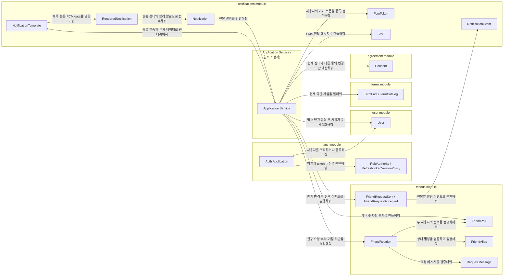
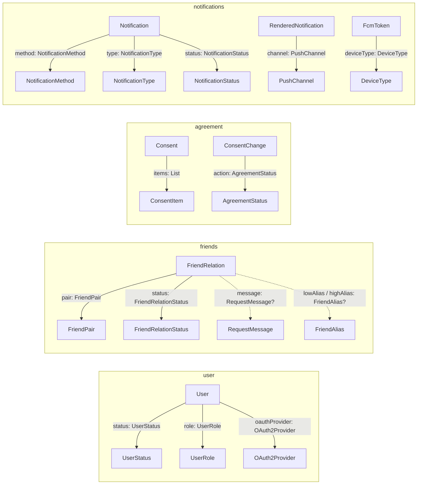

- 이 문서에서는 `ImHere` 에서 사용되는 도메인 개념과 규칙을 설명합니다.
- 다루는 내용
    - 도메인 용어 사전
    - 도메인 세부 설명
        - 책임, 메시지, 속성
        - 상태 전이
        - 불변식 및 비즈니스 규칙 등
    - 도메인 간 관계
        - 도메인 간 협력 관계
        - 도메인 간 포함 관계
- 참고 문서
    - 시스템 구성과 `Spring Modulith` 을 포함한 서버 아키텍처 : imhere-architecture-final.md
    - 전체 배포·운영 구조 : imhere-deployment-and-operation-final.md

---

# 도메인 용어 사전

### 사용자 - `User`

- OIDC 로그인으로 식별되어 ImHere 서비스를 사용하는 사용자
- 상태: `PENDING`, `ACTIVE`, `BLOCKED`, `WITHDRAWN`

### 친구 관계 - `FriendRelation`

- 두 사용자 사이의 친구 요청·친구·거절·차단 관계를 표현하는 Entity
- 상태: `REQUESTED`, `ACCEPTED`, `REJECTED`, `BLOCKED`, `CANCEL`
- 주요 값 객체:
    - `FriendPair`
    - `FriendAlias`
    - `RequestMessage`

### 약관 - `TermJpaEntity`

- 약관의 버전·종류·원문·시행 시각·필수 여부를 저장하는 Entity
- `terms` 모듈 내부의 Persistence Model
- 다른 모듈에는 직접 공개하지 않는다.
- `TermCatalog`가 필요한 약관 사실을 `TermFact` 형태로 제공한다.

### 사용자 약관 동의 - `AgreementJpaEntity`

- 사용자의 약관 동의·철회 이력을 저장하는 Entity
- 상태: `CONSENT`, `WITHDRAW`

### 알림 - `Notification`

- 전달 대상·내용·시도 횟수·전달 상태를 관리하는 알림 Entity
- 상태: `PENDING`, `PROCESSING`, `SENT`, `FAILED`, `UNKNOWN`, `DEAD`
- 주요 식별 기준:
    - `id`
    - `deduplicationKey`

### FCM 토큰 - `FcmToken`

- 특정 사용자의 특정 기기로 Push 알림을 전달하기 위한 등록 토큰 Entity
- 주요 식별 기준:
    - `id`
    - `ownerId`
    - `fcmToken`

---

# 도메인 세부 설명

## User

#### 역할

OIDC 로그인으로 식별된 사용자의 서비스 상태·역할·닉네임과 Refresh Token 버전을 표현한다.

#### 책임

- 신규 사용자를 기본 역할 `NORMAL`, 상태 `PENDING`으로 생성한다.
- 현재 상태에 따라 활성화·차단·차단 해제·탈퇴 가능 여부를 판단한다.
- 닉네임 변경 결과를 새로운 `User` 객체로 반환한다.
- Refresh Token 버전 증가 결과를 새로운 `User` 객체로 반환한다.
- `WITHDRAWN` 상태에서는 더 이상 다른 상태로 전이하지 못하도록 한다.
- 이메일 중복 여부와 영속화 여부는 직접 판단하지 않는다.
    - 이메일 등록 정책과 Repository 사용은 서비스 계층이 담당한다.

#### 메시지

- “가입 대기 중인 나를 활성 사용자로 바꿔줘.”
- “활성 상태인 나를 차단해줘.”
- “차단된 나를 다시 활성화해줘.”
- “활성 또는 차단 상태인 나를 탈퇴시켜줘.”
- “내 닉네임을 변경한 사용자를 만들어줘.”
- “내 Refresh Token 버전을 한 단계 증가시킨 사용자를 만들어줘.”
- “내 역할을 알려줘.”
- “내 상태를 알려줘.”

#### 속성

- `id` (`UUID?`): 사용자 식별자
- `email` (`String`): 계정 이메일 및 기존 사용자 호환 조회에 사용하는 이메일
- `nickname` (`String`): 사용자 표시 이름
- `role` (`UserRole`): `NORMAL`, `ADMIN`
- `oauthProvider` (`OAuth2Provider`): `KAKAO`, `GOOGLE`, `APPLE`
- `status` (`UserStatus`): `PENDING`, `ACTIVE`, `BLOCKED`, `WITHDRAWN`
- `oidcSubject` (`String?`): OIDC Provider가 제공하는 사용자 고유 식별자
- `refreshTokenVersion` (`Long`): Refresh Token 무효화에 사용하는 버전

#### 생성 규칙

- 신규 사용자는 `role = NORMAL`로 생성된다.
- 신규 사용자는 `status = PENDING`으로 생성된다.
- 신규 사용자의 `refreshTokenVersion`은 `0`이다.

#### 상태 전이 규칙

- `activate`는 `PENDING` 상태에서만 가능하다.
- `block`은 `ACTIVE` 상태에서만 가능하다.
- `unblock`은 `BLOCKED` 상태에서만 가능하다.
- `withdraw`는 `ACTIVE` 또는 `BLOCKED` 상태에서만 가능하다.
- `WITHDRAWN`은 최종 상태이며 더 이상 다른 상태로 전이할 수 없다.

```
PENDING ── activate ──▶ ACTIVE

ACTIVE  ── block ─────▶ BLOCKED
BLOCKED ── unblock ───▶ ACTIVE

ACTIVE  ── withdraw ──▶ WITHDRAWN
BLOCKED ── withdraw ──▶ WITHDRAWN
```

#### 검증 책임

- 닉네임의 공백·길이 검증은 `User`가 아니라 `NicknameUpdateRequest`가 담당한다.

## FriendRelation

#### 역할

두 사용자 사이의 친구 요청·친구 관계·거절 제한·차단 상태를 하나의 관계로 표현한다.

#### 책임

- 두 사용자의 친구 요청을 `REQUESTED` 상태로 생성한다.
- 요청을 수락하면 `ACCEPTED` 상태로 변경하고 양쪽 별칭을 설정한다.
- 요청을 거절하면 `REJECTED` 상태로 변경하고 거절한 사용자를 관계의 주체로 설정한다.
- 기존 관계를 차단하면 `BLOCKED` 상태로 변경하고 별칭과 요청 메시지를 제거한다.
- 기존 관계가 없는 사용자도 `BLOCKED` 관계로 생성할 수 있다.
- 요청자가 자신이 보낸 요청을 취소하면 `CANCEL` 상태의 새 관계를 반환한다.
- `ACCEPTED` 상태에서만 별칭을 변경한다.
- 현재 관계가 차단 해제 가능한지 판단한다.
- 차단 해제를 요청한 사용자가 실제 차단 주체인지 판단한다.
- 요청자·대상자·상대방·조회 관점을 계산한다.
- 이미 관계가 존재하는지 조회하지 않는다.
- 새로운 친구 요청 자체를 허용할지는 판단하지 않는다.
    - 기존 관계 조회와 유스케이스 수준의 중복 판단은 `FriendRelationCommandService`가 담당한다.

#### 메시지

- “두 사용자의 친구 요청을 만들어줘.”
- “이 요청을 수락하고 서로의 별칭을 설정해줘.”
- “이 요청을 거절하고 거절한 사용자를 관계의 주체로 설정해줘.”
- “내가 상대방을 차단한 관계로 바꿔줘.”
- “관계가 없는 상대방을 차단 관계로 만들어줘.”
- “내가 보낸 요청을 취소해줘.”
- “내 별칭을 새 값으로 변경해줘.”
- “내가 이 관계를 차단 해제할 수 있는지 알려줘.”
- “내가 요청을 보낸 사용자인지 알려줘.”
- “이 사용자의 상대방을 알려줘.”
- “이 사용자의 관점에서 보낸 요청인지 받은 요청인지 알려줘.”

#### 속성

- `id` (`UUID?`): 관계 식별자
- `pair` (`FriendPair`): 관계에 참여하는 두 사용자
- `status` (`FriendRelationStatus`): `REQUESTED`, `ACCEPTED`, `REJECTED`, `BLOCKED`, `CANCEL`
- `modifierId` (`UUID`): 현재 요청·거절·차단을 발생시킨 사용자
- `message` (`RequestMessage?`): 친구 요청 메시지
- `lowAlias` (`FriendAlias?`): `pair.low` 사용자가 상대방에게 부여한 별칭
- `highAlias` (`FriendAlias?`): `pair.high` 사용자가 상대방에게 부여한 별칭
- `rejectionExpiredAt` (`LocalDateTime?`): 거절 제한 만료 시각 또는 영구 차단을 나타내는 시각
- `createdAt` (`LocalDateTime?`): 생성 시각
- `updatedAt` (`LocalDateTime?`): 마지막 변경 시각

#### 불변식

- `modifierId`는 항상 `pair`의 구성원이어야 한다.
- `FriendPair`는 서로 다른 두 사용자를 표현하므로 자기 자신과의 관계를 허용하지 않는다.

#### 상태 전이 규칙

- `accept`는 `REQUESTED` 상태에서만 가능하다.
- `reject`는 `REQUESTED` 상태에서만 가능하다.
- `rename`은 `ACCEPTED` 상태에서만 가능하다.
- `rename`은 관계 구성원만 수행할 수 있다.
- `unblock`은 다음 조건을 모두 만족해야 한다.
    - 현재 상태가 `BLOCKED`다.
    - 요청자가 기존 차단 주체다.

```
없음 ── request ──────────▶ REQUESTED
없음 ── block ────────────▶ BLOCKED

REQUESTED ── accept ──────▶ ACCEPTED
REQUESTED ── reject ──────▶ REJECTED
REQUESTED ── cancel ──────▶ CANCEL
REQUESTED ── block ───────▶ BLOCKED

ACCEPTED ── block ────────▶ BLOCKED
ACCEPTED ── delete ───────▶ 없음

REJECTED ── block ────────▶ BLOCKED
REJECTED ── expire ───────▶ 없음

BLOCKED ── unblock ────────▶ 없음
```

#### 만료 규칙

- `REJECTED` 관계는 거절 시점으로부터 한 달 뒤 만료된다.
- `BLOCKED` 관계는 만료되지 않으며 `PERMANENT` 시각을 사용한다.

#### 책임 경계

- 만료된 `REJECTED` 관계를 근거로 새로운 친구 요청을 허용할지는 `FriendRelation`이 판단하지 않는다.
- 만료된 관계의 삭제는 Scheduler가 담당한다.
- 새로운 친구 요청 가능 여부는 서비스 계층에서 판단한다.

#### 값 객체

**`FriendPair`**

- 두 사용자 UUID를 `low`, `high` 순서로 정규화한다.
- 자기 자신과의 관계를 허용하지 않는다.
- 관계에 포함되지 않은 사용자의 접근을 거부한다.

**`FriendAlias`**

- 친구에게 부여하는 개인별 별칭을 표현한다.
- 공백 문자열을 허용하지 않는다.
- 최대 10자까지 허용한다.

**`RequestMessage`**

- 친구 요청에 포함되는 메시지를 표현한다.
- 공백 문자열을 허용하지 않는다.
- 최소 10자 이상이어야 한다.

## Consent

#### 역할

한 번의 약관 동의 요청에서 사용자가 각 약관에 표시한 동의·철회 의사를 표현하고, 현재 동의 상태와 비교해 실제 변경만 계산한다.

#### 책임

- 동일한 약관이 요청에 여러 번 포함되면 마지막 요청을 사용한다.
- 현재 상태와 요청 상태를 비교하여 실제 상태 전환만 `ConsentChange`로 반환한다.
- 동의와 철회 결과를 `AgreementStatus`로 표현한다.
- 현재 유효한 약관이 무엇인지는 판단하지 않는다.
- 필수 약관을 모두 충족했는지는 판단하지 않는다.
    - 현재 약관 조회는 `TermCatalog`가 담당한다.
    - 필수 약관 충족 여부는 `AgreementService`가 담당한다.

#### 메시지

- “이 동의 요청을 현재 상태와 비교해서 실제 변경만 알려줘.”
- “같은 약관이 여러 번 요청되었다면 마지막 의사를 적용해줘.”

#### 속성

- `items` (`List<ConsentItem>`): 약관 ID와 동의 여부로 구성된 요청 목록

#### 변경 계산 규칙

- 동일한 `termId`가 여러 번 포함되면 마지막 요청 하나만 사용한다.
- 현재 상태와 동일한 요청은 변경으로 반환하지 않는다.

#### 상태 변화

```
현재 상태 없음 + 동의 요청 ──▶ CONSENT

CONSENT + 철회 요청 ─────────▶ WITHDRAW
WITHDRAW + 재동의 요청 ──────▶ CONSENT

현재 상태와 같은 요청 ───────▶ 변경 없음
```

## Notification

#### 역할

FCM 또는 SMS로 전달할 알림의 대상·내용·전달 상태와 재시도 이력을 표현한다.

#### 책임

- 렌더링된 알림을 기반으로 실제 전달 대상별 알림을 생성한다.
- `deduplicationKey`를 이용해 같은 이벤트와 전달 수단에 해당하는 알림을 식별한다.
- 현재 상태에서 외부 전달을 시도할 수 있는지 판단한다.
- FCM 알림이 사용자 수신함에 노출될 수 있는지 판단한다.
- 발송 준비·처리 중·성공·실패·결과 불명·최종 실패 상태를 관리한다.
- 실패 횟수와 재시도 가능 여부에 따라 `FAILED` 또는 `DEAD` 상태를 결정한다.
- `DEAD` 상태의 알림을 운영자 재처리를 위해 다시 `PENDING` 상태로 전환할 수 있다.

## 약관 모델

`terms` 모듈 구성

- `TermJpaEntity`  : 약관 저장 모델
- `TermFact` : 다른 모듈에 공개하는 최소 약관 정보
- `TermCatalog`  : TermFact를 제공하는 공개 계약

#### TermJpaEntity

- `TermJpaEntity`는 약관의 전체 정보를 DB에 저장하기 위한 Persistence Entity다.
    - 속성값
        - `id`
        - `version`
        - `type`
        - `title`
        - `content`
        - `effectiveDate`
        - `isRequired`

#### TermFact

- `terms` 모듈이 `agreement` 모듈에 약관 정보를 전달하기 위한 반환용 `data class`
- `agreement`가 약관 동의 여부를 판단하는 데 필요한 최소 정보
    - `id`
    - `version`
    - `type`
    - `isRequired`

---

# 도메인 관계

#### 협력 기반(메시지)



### 도메인 간 포함 관계

- 점선 : `nullable`
- 실선 : 필수값


