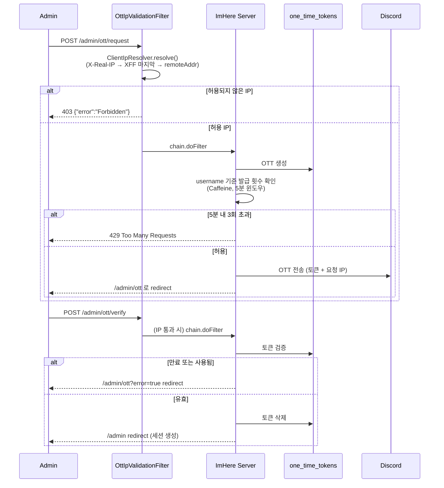

# Admin OTT 로그인 흐름

관리자 콘솔 접근 시 사용하는 One-Time Token 로그인 절차를 정리한 문서다. 모바일 JWT 흐름과 별개인 운영용 인증 체인이다.

---

## 핵심 판단

| 판단 | 내용 | 근거 |
|---|---|---|
| admin 전 경로 IP 제한 | 로그인 페이지를 포함한 `/admin/**` 모든 요청을 허용 IP 가 아니면 즉시 차단한다 | 관리자 콘솔의 존재 자체를 비허용 IP 에 숨긴다 (`OttIpValidationFilter.kt:27-37`) |
| 신뢰 IP 는 X-Real-IP 우선 | XFF 첫 요소 스푸핑을 막기 위해 추출 우선순위를 고정한다 | `ClientIpResolver.kt:20-35` |
| OTT 발급 횟수 제한 | username 기준 5분 윈도우 내 최대 3회, 초과 시 429 | `ImHereOttSuccessHandler.kt:37-78` |
| OTT 는 Discord 전달을 전제 | 토큰은 내부 채널로 보내고, 사용자는 검증 단계에서 입력한다 | 평문 비밀번호 기반 운영 로그인을 피한다 |
| 성공 후 세션 로그인으로 전환 | OTT 검증 성공 시 관리자 웹은 세션 기반으로 들어간다 | 브라우저 관리 화면과 모바일 API 인증 모델을 분리한다 |

---

## 시퀀스

> 아래 다이어그램에서 `OttIpValidationFilter`는 특정 한 경로가 아니라 admin 체인(`/admin/**`, `/api/admin/**`)에 도달하는 **모든 요청**에서 가장 먼저 실행된다. 즉 `/admin/login`, `/admin/ott`, `/admin/ott/verify` 등 모든 단계가 IP allowlist를 통과해야 한다. 편의상 발급 흐름에만 명시한다.

---

## 구현 포인트

1. IP 제한과 발급 횟수 제한은 다른 정책이다. IP 제한은 필터 최전단에서 admin 전 경로를 막고, 발급 횟수 제한은 OTT 발급 성공 핸들러에서 username 기준으로 센다.
2. 신뢰 IP 추출은 `ClientIpResolver` 한 곳에 모여 있고, 필터와 발급 핸들러가 같은 로직을 공유한다. X-Real-IP 를 우선하고 XFF 첫 요소는 신뢰하지 않는다 (자세한 이유: [../security/admin-ott.md](../security/admin-ott.md#1-신뢰-가능한-클라이언트-ip-추출--clientipresolver)).
3. OTT 는 1회성이라 검증 성공 후 즉시 제거된다.
4. 관리자 로그인 성공 결과는 모바일 JWT 가 아니라 웹 세션이다.

---

## 코드 기준점

- `src/main/kotlin/com/kdongsu5509/auth/security/ClientIpResolver.kt`
- `src/main/kotlin/com/kdongsu5509/auth/security/filter/OttIpValidationFilter.kt`
- `src/main/kotlin/com/kdongsu5509/auth/security/config/SecurityConfig.kt`
- `src/main/kotlin/com/kdongsu5509/auth/security/handler/ImHereOttSuccessHandler.kt`
- `src/main/kotlin/com/kdongsu5509/auth/security/handler/OttLoginSuccessHandler.kt`

---

## 연관 문서

- [../security/admin-ott.md](../security/admin-ott.md)
- [../security/README.md](../security/README.md)
- [practical-feature-flows.md](practical-feature-flows.md#8-setting--my-info--terms)
