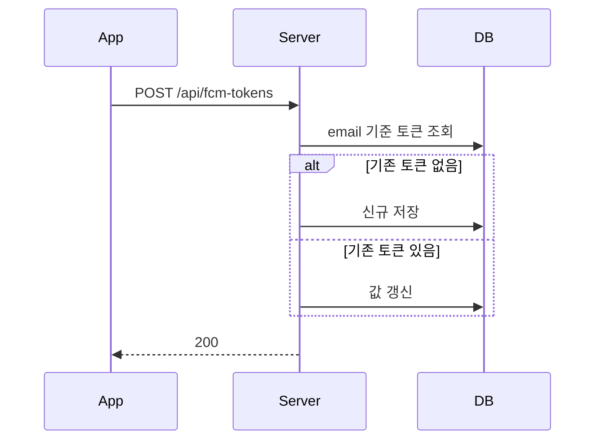
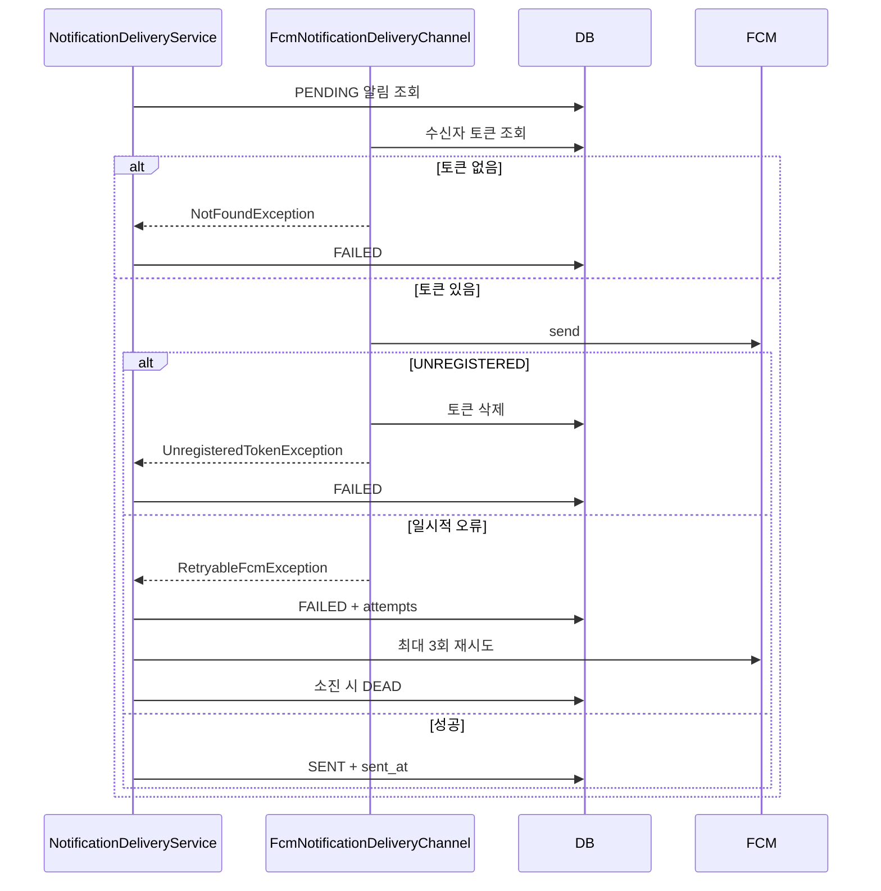

# FCM 토큰 등록과 발송 실패 체인

FCM 토큰을 사용자 기준으로 upsert하고, 외부 발송 결과를 `Notification` 상태 전이로 기록하는 규칙이다.

## 핵심 판단

| 판단 | 내용 |
|---|---|
| 사용자별 최신 토큰 | email 기준 현재 토큰을 insert/update한다 |
| `UNREGISTERED` | 유효하지 않은 토큰을 삭제하고 알림 실패를 기록한다 |
| 일시적 서버 오류 | `UNAVAILABLE`, `QUOTA_EXCEEDED`, `INTERNAL`은 Spring Retry 대상이다 |
| 모든 결과 기록 | 성공은 `SENT`, 실패는 `FAILED`, 3회 소진은 `DEAD`로 같은 행에 남긴다 |

## 토큰 등록

## 전송 실패 체인

## 코드 기준점

- `notifications/application/service/FcmTokenEnrollService.kt`
- `notifications/application/service/channel/FcmNotificationDeliveryChannel.kt`
- `notifications/application/service/NotificationDeliveryService.kt`
- `notifications/adapter/out/firebase/FirebaseAdapter.kt`

## 연관 문서

- [notification-pipeline.md](notification-pipeline.md)
- [failed-notification-replay.md](failed-notification-replay.md)
