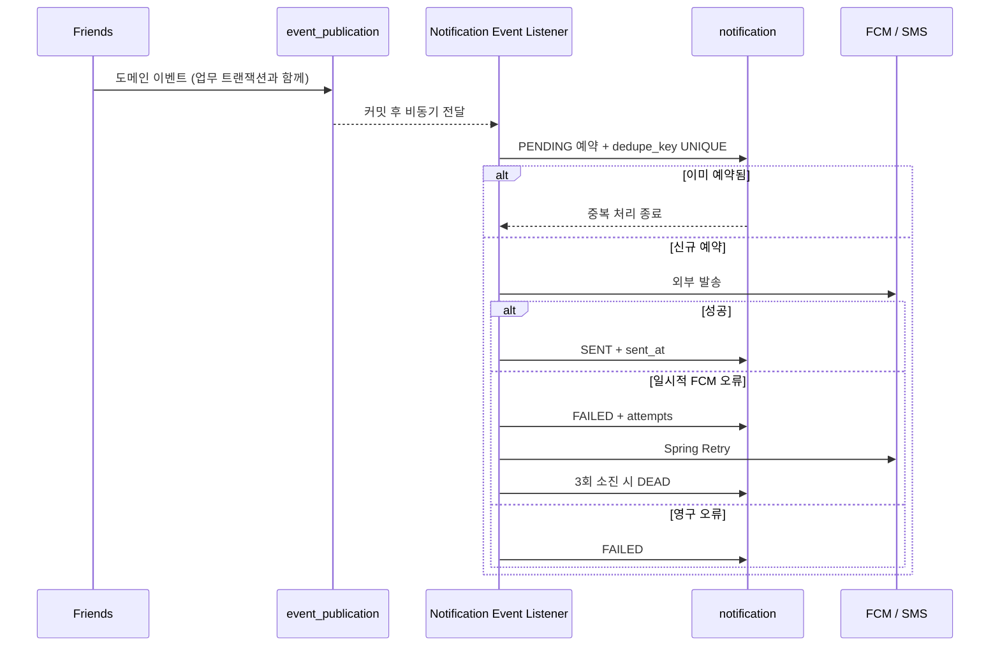

# 알림 이벤트 발송 흐름

Spring Modulith Application Events가 발행 트랜잭션과 이벤트 기록을 묶고, `Notification` 애그리게이트가 발송 생애주기를 소유한다. 외부 메시지 큐·consumer·DLQ와 로컬 멱등 캐시는 사용하지 않는다.

## 핵심 판단

| 판단 | 내용 |
|---|---|
| 모듈 결합 | friends는 `FriendRequestSent`/`FriendRequestAccepted`만 발행하고 notifications가 알림으로 번역한다 |
| 커밋 경계 | `@ApplicationModuleListener`가 AFTER_COMMIT에 비동기로 처리하므로 롤백된 업무의 유령 알림은 나가지 않는다 |
| 멱등성 | `dedupe_key = "{eventId}:{method}"` UNIQUE 제약으로 중복 예약을 억제한다 |
| 재시도 | `RetryableFcmException`은 Spring Retry로 최대 3회(1초, 2초, 최대 8초) 시도한다 |
| 운영 가시성 | 최종 실패는 `Notification.DEAD`로 남기고 관리자 API/화면에서 재발송한다 |

## 시퀀스

## 이벤트 경계

- `shared.event.DomainEvent`: 모든 이벤트에 `eventId`와 `occurredAt`을 강제한다.
- `shared.event.DomainEventPublisher`: 향후 다른 이벤트 전송 구현으로 바꿀 수 있는 발행 포트다.
- `friends::event`: notifications가 참조할 수 있는 유일한 friends 공개 경계다.
- `NotificationRequested`: 클라이언트 API와 발송 성공/실패 영수증에 쓰는 notifications 내부 이벤트다.

## 발송 상태와 회수

- `PENDING`: 예약됐으나 외부 발송이 완료되지 않음
- `SENT`: 외부 채널 발송 성공
- `FAILED`: 재시도 가능한 실패
- `DEAD`: 최대 3회 소진
- `NotificationRecoveryScheduler`: 5분 이상 갱신되지 않은 `PENDING`/`FAILED`를 분당 회수한다.

보장 수준은 **at-least-once 전달 + DB UNIQUE 기반 중복 억제**다. 외부 발송 성공 직후 `SENT` 커밋 전에 프로세스가 종료되면 재발송될 수 있다.

## 플랫폼 채널

| PushChannel | Android | iOS |
|---|---|---|
| `CRITICAL` | `fcm_critical_channel` / HIGH | priority 10 / time-sensitive / default |
| `HIGH` | `fcm_high_channel` / HIGH | priority 10 / active / default |
| `NORMAL` | `fcm_normal_channel` / HIGH | priority 10 / active / default |
| `SILENT` | `fcm_silent_channel` / NORMAL | priority 5 / passive / 무음 |

`DeviceType.AOS`에는 `AndroidConfig`, `DeviceType.IOS`에는 `ApnsConfig`만 붙는다.

## 제약

- 인메모리 이벤트는 발행 인스턴스에서만 처리된다. 서버 스케일아웃 시 외부 브로커를 재검토한다.
- `event_publication.serialized_event`는 `VARCHAR(4000)`이므로 이벤트에 큰 payload를 싣지 않는다.
- iOS APNs 정책은 실제 기기와 집중 모드에서 별도 수동 검증이 필요하다.

## 코드 기준점

- `friends/event/`
- `notifications/adapter/in/event/`
- `notifications/application/service/NotificationDeliveryService.kt`
- `notifications/application/service/NotificationRecorder.kt`
- `notifications/scheduler/NotificationRecoveryScheduler.kt`
- `notifications/domain/Notification.kt`
- `notifications/domain/PushChannel.kt`

## 연관 문서

- [failed-notification-replay.md](failed-notification-replay.md)
- [fcm-token-failure-chain.md](fcm-token-failure-chain.md)
- [../architecture/domain.md](../architecture/domain.md#notification)
