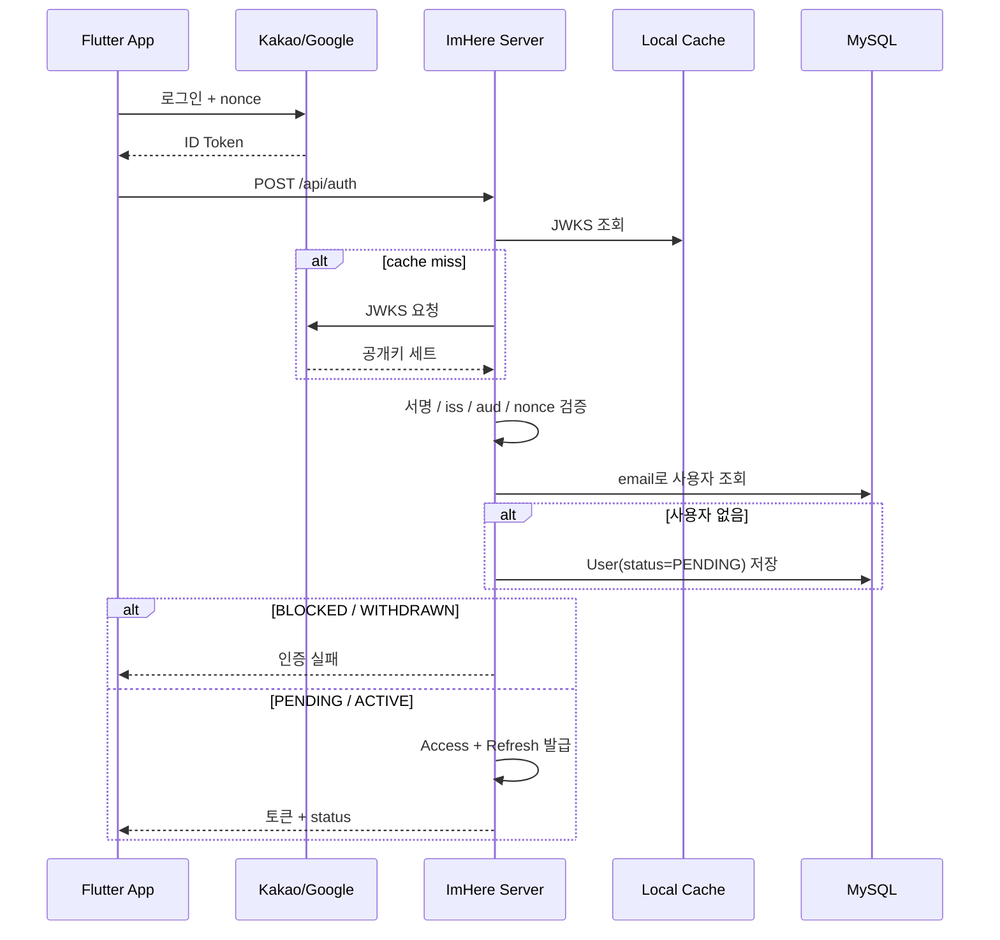

# Kakao / Google OIDC 인증 흐름

`/api/auth`는 **가입과 로그인을 구분하지 않습니다.** 계정이 없으면 만들고, 있으면 그대로 로그인시킵니다.

OIDC에서는 ID Token 하나로 신원이 확정되기 때문에 "가입 요청"과 "로그인 요청"의 입력이 완전히 같습니다.
그래서 서버가 둘을 나누지 않고, 클라이언트도 "이 사람이 신규인지 기존인지"를 미리 알 필요가 없습니다.

---

## 핵심 판단

| 결정 | 내용 | 근거 |
|---|---|---|
| 가입/로그인 엔드포인트 통합 | 입력(provider + idToken + nonce)이 동일하므로 `/api/auth` 하나로 처리 | `AuthController.kt`, `AuthService.kt` |
| 계정이 없으면 생성 | 미가입자를 거절하지 않고 `PENDING` 계정을 만들어 토큰 발급 | `AuthService.kt` (`registerNewUser`) |
| `PENDING` 인증 허용 | 약관 동의 화면으로 보내기 위해 토큰 발급 | `AuthService.kt` (`validateLoginable`) |
| `BLOCKED` / `WITHDRAWN`은 거절 | 재가입 경로로도 우회할 수 없도록 토큰 발급 직전에 한 번만 판정 | `AuthService.kt` (`validateLoginable`) |
| OIDC 검증과 인증 판단 분리 | 검증은 `OIDCVerifyService`, 상태 판단은 `AuthService` | `OIDCVerifyService.kt:23` |

---

## 시퀀스



---

## 실제 요청 예시

```http
POST /api/auth
Content-Type: application/json

{
  "provider": "GOOGLE",
  "idToken": "eyJhbGciOiJSUzI1NiIsImtpZCI6I...",
  "nonce": "f85f7a3f"
}
```

응답의 `userStatus`로 신규/기존을 구분합니다. 갓 만들어진 계정은 항상 `PENDING`입니다.

---

## 주의점

* nonce는 필수입니다.
* email claim이 없으면 인증할 수 없습니다.
* `PENDING`은 인증 성공이지만 메인 화면 진입 조건은 아닙니다. 약관 동의 화면으로 보내야 합니다.
* 미가입자에게 "가입되지 않은 계정입니다"를 안내할 수 없습니다. 통합의 대가입니다.

---

## 코드 근거

* OIDC 검증: `src/main/kotlin/com/kdongsu5509/auth/application/service/OIDCVerifyService.kt:23`
* 인증(가입 겸 로그인): `src/main/kotlin/com/kdongsu5509/auth/application/service/AuthService.kt`
* 엔드포인트: `src/main/kotlin/com/kdongsu5509/auth/adapter/in/web/AuthController.kt`

---

## 관련 문서

* 가입 이후 활성화: [oidc-signup-activation.md](oidc-signup-activation.md)
* JWT 구조: [../security/jwt.md](../security/jwt.md)
* 앱 실전 흐름: [practical-feature-flows.md](practical-feature-flows.md#1-auth--login--terms)
