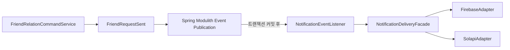

---
# 수정 필요
---
---

# 2. Server Architecture

이 문서는 `ImHereServer` 저장소의 실제 소스 코드, Gradle 설정, 테스트, 애플리케이션 설정과 Docker 구성을 기준으로 작성한 **서버 전용 아키텍처 문서**다.

Flutter Mobile App과 Web App은 서버에 요청을 보내는 외부 클라이언트로만 설명한다. 클라이언트 저장소의 화면·상태 관리·빌드·배포 구조와 AWS 인프라 전체 구성은 이 문서의 범위가 아니며, [imhere-deployment-and-operation-final.md](imhere-deployment-and-operation-final.md)에서 다룬다.

서버 문서에서 다루는 범위는 Spring Boot 애플리케이션, 패키지 모듈, Spring Modulith, 요청 처리, 인증·인가, 데이터 흐름, 외부 Provider 연동, 트랜잭션과 관측성이다. 저장소에서 확인되지 않는 RabbitMQ·Redis·별도 Notification Consumer 프로세스는 현재 구조로 기술하지 않는다.

## 2.1 Architecture Overview

### 전체 시스템 구성

```text
Flutter Mobile App
        │
        │ HTTPS
        ▼
nginx (운영 Docker Compose)
        │ TLS 종료 / Reverse Proxy
        ▼
Spring Boot Application (단일 Gradle 프로젝트 · 단일 JVM 컨테이너)
        │
        ├── auth
        ├── user
        ├── friends
        ├── notifications
        ├── terms / agreement
        ├── maps / admin
        └── shared / support
             │
             ├──────────────► MySQL
             │                 업무 테이블 + event_publication
             │
             ├──────────────► Caffeine Local Cache
             │                 OIDC JWKS + Refresh Token 상태
             │
             ├──────────────► Google / Kakao / Apple OIDC JWKS
             ├──────────────► Naver Map API
             ├──────────────► Firebase Cloud Messaging
             ├──────────────► Solapi SMS
             └──────────────► Discord Webhook

Spring Boot Application ── OTLP ──► Alloy ──► Grafana Cloud
```

운영 컨테이너 구성은 `ImHereServer/docker-compose.yml`에 정의되어 있다. `dsko`가 Spring Boot 애플리케이션이고, `nginx`가 외부 80/443 요청을 받아 애플리케이션으로 전달한다. `alloy`는 Docker 로그·애플리케이션 관측 데이터를 수집하는 별도 컨테이너다. 로컬 프로파일에는 애플리케이션과 Prometheus/Grafana가 정의되어 있다.

| 구성 요소 | 코드에서 확인되는 책임 |
|---|---|
| Flutter App | 모바일 UI, OIDC 로그인 수행, ID Token과 서비스 JWT를 API에 전달하는 클라이언트. 모바일 소스는 이 서버 저장소의 범위 밖이다. |
| nginx | 운영 환경에서 TLS 종료, 외부 요청 수신, Spring 컨테이너로 Reverse Proxy. |
| Spring Boot Application | HTTP 진입점, 인증/인가, 도메인 서비스, MySQL 접근, 외부 API Adapter를 한 JVM에서 실행한다. |
| MySQL | 사용자·친구·약관·동의·FCM 토큰·알림 상태 및 Spring Modulith `event_publication`을 영속화한다. |
| Caffeine Local Cache | `CachePort` 구현체인 `LocalCacheAdapter`가 OIDC 공개키와 refresh token 회전 상태를 저장한다. Redis 설정이나 Redis 의존성은 확인되지 않는다. |
| Spring Modulith | 모듈 경계를 검증하고 Application Event를 `event_publication`에 기록한 뒤 `@ApplicationModuleListener`로 전달한다. |
| FCM / Solapi | `notifications`의 Adapter가 각각 Push와 SMS를 전송한다. |
| OIDC Provider | 서버가 ID Token의 서명 검증에 필요한 JWKS와 issuer/audience 기준을 사용한다. |

### 현재 알림 구조와 RabbitMQ 표기의 차이

포트폴리오에서 자주 쓰는 다음 그림은 ImHere의 현재 구현이 아니다.

```text
Flutter → Spring Server → MySQL → RabbitMQ → Notification Consumer → FCM / SMS
```

저장소에서 확인되는 실제 흐름은 다음이다.

```text
Flutter
   │ POST /api/notifications
   ▼
NotificationCommandController
   ▼
NotificationService.requestDelivery()
   │ DomainEventPublisher → ApplicationEventPublisher
   ▼
MySQL event_publication
   │ 트랜잭션 커밋 후 Spring Modulith 디스패치
   ▼
NotificationEventListener (@ApplicationModuleListener)
   ▼
NotificationDeliveryFacade
   ├── FirebaseAdapter ──► Firebase Cloud Messaging
   └── SolapiAdapter ────► Solapi SMS
```

`build.gradle`에는 RabbitMQ/Kafka client가 없고 `RabbitTemplate`, `@RabbitListener`, `KafkaTemplate`, `@KafkaListener` 사용도 확인되지 않는다. 따라서 RabbitMQ를 구현 구성 요소로 표현하지 않는다.

### 저장소 형태

`settings.gradle`은 `rootProject.name = 'imhere'`만 정의하고 `include(...)`를 정의하지 않는다. 각 도메인이 별도 Gradle Module인 멀티모듈 프로젝트가 아니라 하나의 Gradle 프로젝트 안에서 Spring Modulith 패키지 모듈을 사용한다.

관련 코드

- `ImHereServer/settings.gradle`
- `ImHereServer/build.gradle`
- `ImHereServer/Dockerfile`
- `ImHereServer/docker-compose.yml`
- `ImHereServer/src/main/kotlin/com/kdongsu5509/ImhereApplication.kt`
- `ImHereServer/src/main/resources/application.yaml`

## 2.2 Request Flow

### 공통 API 요청 흐름

```text
Flutter App
    │ HTTPS + Authorization: Bearer <Access Token>
    ▼
nginx (운영 환경)
    ▼
SecurityFilterChain
    ▼
JwtAuthenticationFilter
    ├── 토큰 없음: 다음 필터로 전달 → 보호 API는 authenticated 조건에서 거절
    └── 토큰 있음: ImHereTokenParserPort로 검증/파싱
             ▼
       ImHereUserDetails 생성
             ▼
       SecurityContextHolder에 Authentication 저장
             ▼
Controller
    ▼
Application Service / Domain Service
    ▼
Repository 또는 Port
    ▼
MySQL / 외부 Adapter
    ▼
HTTP Response
```

`SecurityConfig`는 `/api/**`를 Stateless로 설정하고 `JwtAuthenticationFilter`를 `UsernamePasswordAuthenticationFilter` 앞에 등록한다. Controller는 `@AuthenticationPrincipal` 또는 `@AuthenticationPrincipal(expression = "userId")`로 필터가 만든 인증 주체를 받는다.

### 요청 1: 친구 요청 생성

```text
POST /api/friends/requests
        │
        ▼
FriendRequestController.request()
        │ userId: @AuthenticationPrincipal(expression = "userId")
        │ request: NewFriendRequest(targetId, message)
        ▼
FriendRelationCommandService.sendRequest()
        │ @Transactional (클래스 레벨)
        ├── UserLookupContract.findById(requesterId)
        ├── UserLookupContract.findById(receiverId)
        ├── FriendRelationRepository.findByPair()
        ├── FriendRelation 도메인 생성 및 상태 규칙 확인
        ├── FriendRelationRepository.save()
        └── DomainEventPublisher.publish(FriendRequestSent)
        ▼
FriendRequestView → NewFriendRequestResponse
        ▼
HTTP Response

커밋 후 별도 흐름
FriendRequestSent
        ▼
NotificationEventListener.handle(FriendRequestSent)
        ▼
NotificationDeliveryFacade.deliver(NotificationEvent)
        ▼
FCM 전송 및 Notification 상태 저장
```

Controller는 입력 DTO와 인증 주체를 서비스에 전달하고, 친구 관계 상태 판단은 `FriendRelationCommandService`와 `FriendRelation`에 있다. 친구 모듈은 `UserLookupContract`로 사용자 정보를 얻고 알림 모듈의 클래스를 직접 호출하지 않는다. `FriendRequestSent`는 `friends.event` Named Interface로 공개되고 `notifications`가 이를 구독한다.

### 요청 2: 약관 동의 및 사용자 활성화

```text
POST /api/agreements
        │
        ▼
AgreementController.consent()
        │ @AllowPendingUser
        │ AgreementConsentRequest → TermsConsentCommands
        ▼
AgreementService.consent()
        │ @Transactional
        ├── TermCatalog.findEffectiveTermFacts()
        ├── AgreementRepository.findHistory()
        ├── Consent 변경 상태 계산
        ├── AgreementRepository.recordChanges()
        ├── 필수 약관 동의 여부 판단
        └── UserActivationContract.activateIfPending()
        ▼
UserLifecycleService.activateIfPending()
        │ @Transactional
        ├── UserRepository.findById()
        ├── User.activate()
        └── UserRepository.update()
        ▼
204 No Content
```

이 흐름에서 `agreement`는 약관 원문을 직접 소유하지 않고 `TermCatalog`를 사용하며, 사용자 상태 변경은 `UserActivationContract`로 요청한다. `ModularityTest`는 `agreement → user`, `agreement → terms` 방향과 역방향이 없음을 검증한다.

### 요청 3: 알림 발송 요청

```text
POST /api/notifications
        │
        ▼
NotificationCommandController.send()
        │ NotificationRequest → NotificationCommand
        ▼
NotificationService.requestDelivery()
        │ @Transactional
        └── NotificationEvent.from(command)
            └── DomainEventPublisher.publish(event)
        ▼
202 Accepted
"알림이 발송 큐에 등록되었습니다."

트랜잭션 커밋 후
NotificationEventListener.handle(NotificationEvent)
        ▼
NotificationDeliveryFacade.deliver()
        ├── NotificationRegister.findByDedupeKey()
        ├── NotificationRegister.register()
        ├── NotificationRegister.claimForDelivery()
        ├── NotificationChannelSender.sendViaExternalMethod()
        │     ├── FirebasePort → FirebaseAdapter → FCM
        │     └── ExternalMessagePort → SolapiAdapter → Solapi
        └── NotificationRegister.markAsSent/markFailed/markDead()
```

HTTP 요청은 외부 채널의 전송 완료를 기다리지 않고 202를 반환한다. 실제 전송은 `@ApplicationModuleListener` 이후에 수행되며, 상태 저장은 `NotificationRegister`의 `REQUIRES_NEW` 트랜잭션으로 분리되어 있다.

관련 코드

- `src/main/kotlin/com/kdongsu5509/friends/controller/FriendRequestController.kt`
- `src/main/kotlin/com/kdongsu5509/friends/service/FriendRelationCommandService.kt`
- `src/main/kotlin/com/kdongsu5509/agreement/controller/AgreementController.kt`
- `src/main/kotlin/com/kdongsu5509/agreement/service/AgreementService.kt`
- `src/main/kotlin/com/kdongsu5509/notifications/adapter/in/web/NotificationCommandController.kt`
- `src/main/kotlin/com/kdongsu5509/notifications/application/service/NotificationService.kt`

## 2.3 Package Structure

```text
com.kdongsu5509
├── auth
│   ├── adapter/in/web              # 로그인·refresh·관리자 웹 진입점
│   ├── adapter/out/cache           # OIDC 공개키 CachePort Adapter
│   ├── adapter/out/jwt             # JJWT 기반 발급·파싱·검증
│   ├── adapter/out/oauth           # OIDC JWKS HTTP Client
│   ├── application/port/in         # AuthUseCase, TokenRefreshUseCase
│   ├── application/port/out        # 토큰·OIDC·공개키 Port
│   ├── application/service         # 인증·OIDC 검증·refresh 서비스
│   ├── domain                      # RoleAuthority, RefreshTokenVersionPolicy
│   ├── security                     # SecurityConfig, JWT Filter, 인가 Manager
│   └── config                       # Auth client 설정
├── user
│   ├── api                         # 다른 모듈에 공개하는 Contract/Command/Result
│   ├── controller                  # 사용자 HTTP API
│   ├── domain                      # User, UserStatus, OAuth2Provider 등
│   ├── repository                   # 도메인 Repository와 Mapper
│   ├── repository/jpa              # JPA Entity, Spring Data/QueryDSL 구현
│   └── service                     # 조회·등록·생명주기·프로필 처리
├── friends
│   ├── api                         # FriendAliasContract
│   ├── controller                  # 친구 요청·관계·제한 API
│   ├── domain                      # FriendRelation 상태와 도메인 규칙
│   ├── event                       # FriendRequestSent/Accepted
│   ├── repository                   # 관계 Repository와 QueryDSL 구현
│   ├── service                     # Command/Query/Member Loader
│   └── scheduler                   # 제한 관계 정리
├── notifications
│   ├── adapter/in/web              # 알림·FCM token·관리자 API
│   ├── adapter/in/event            # Modulith 이벤트 Listener
│   ├── adapter/out/firebase        # FirebaseAdapter
│   ├── adapter/out/solapi          # SolapiAdapter
│   ├── adapter/out/persistence     # JPA Entity/Mapper/Repository Adapter
│   ├── adapter/out/friend          # FriendAliasAdapter
│   ├── application/port/in         # NotificationUseCase
│   ├── application/port/out        # Persistence, FCM, SMS Port
│   ├── application/service         # 접수·등록·발송·결과 처리
│   ├── domain                      # Notification 상태·템플릿·채널 규칙
│   ├── event                       # NotificationEvent/Receipt/Failure
│   └── scheduler                   # 정체 알림 복구 및 UNKNOWN 조회
├── terms                           # 약관 원문·버전·TermCatalog
├── agreement                       # 사용자 약관 동의 이력·활성화
├── maps                            # Naver Map Proxy
├── admin                           # 운영 상태 모델
├── shared                          # Open 모듈: 응답·공통 이벤트·CachePort
└── support                         # Open 모듈: 설정·예외·로깅·Discord/Async
```

| 패키지 | 책임 | 관찰되는 분리 효과 |
|---|---|---|
| `auth` | OIDC 검증, 서비스 JWT 발급/갱신, Spring Security Filter Chain | OIDC/JJWT 구현이 `application.port.out` 뒤에 놓인다. |
| `user` | 사용자 등록·조회·활성·차단·탈퇴 | 외부 모듈은 `user.api` 계약만 사용하고 `UserRepository`/서비스는 공개하지 않는다. |
| `friends` | 친구 관계 상태 변경과 조회 | 관계 도메인이 사용자 조회 계약과 자체 Repository를 조합한다. |
| `notifications` | 이벤트를 알림 상태로 변환하고 FCM/SMS 발송·복구 | 외부 채널 SDK가 `FirebasePort`/`ExternalMessagePort` 뒤에 놓인다. |
| `terms` / `agreement` | 약관 원문과 사용자 동의 이력 | `agreement`가 `TermCatalog`와 `UserActivationContract`를 사용한다. |
| `shared` / `support` | 공통 이벤트·응답·캐시 포트, 예외·관측 기반 | Spring Modulith `OPEN` 모듈로 선언되어 공통 기반을 제공한다. |

## 2.4 Module Structure

### Gradle Module

멀티모듈 Gradle 구조는 확인되지 않는다.

```text
root project: imhere
└── 단일 Gradle 프로젝트
    ├── src/main/kotlin
    ├── src/main/java (package-info.java의 Modulith Named Interface)
    └── src/test/kotlin
```

`settings.gradle`에 `include`가 없고 `build.gradle`에도 `implementation(project(...))`가 없다. 아래의 모듈은 Gradle Module이 아니라 Spring Modulith Application Module이다.

### Spring Modulith Module

```text
auth ────────────────► user.api / user.domain
agreement ───────────► user.api
agreement ───────────► terms
notifications ──────► friends.event

friends ──(직접 notifications 참조 없음)──► notifications 이벤트 처리 대상

모든 모듈 ───────────► shared / support
                       (둘 다 @ApplicationModule(type = OPEN))
```

실제 테스트로 확인되는 의존 관계는 다음과 같다.

| 출발 모듈 | 도착 모듈/공개 경계 | 근거 |
|---|---|---|
| `auth` | `user`의 `api`, `domain` | `AuthModularityTest`가 auth의 직접 의존에 user가 있고 friends/notifications가 없음을 검증한다. |
| `agreement` | `user.api`, `terms` | `ModularityTest`가 `agreement → user`, `agreement → terms`와 역방향 없음을 검증한다. |
| `notifications` | `friends.event` | `ModularityTest`가 notifications가 friends에 의존하고 friends는 notifications에 의존하지 않음을 검증한다. |
| 각 모듈 | `shared`, `support` | `shared`, `support`의 package-info가 `OPEN` 모듈이다. |

### Named Interface

```text
auth
└── security.shared @NamedInterface("shared")

user
├── api    @NamedInterface("api")
└── domain @NamedInterface("domain")

friends
├── api   @NamedInterface("api")
└── event @NamedInterface("event")

shared  @ApplicationModule(type = OPEN)
support @ApplicationModule(type = OPEN)
```

`ModularityTest`는 `ApplicationModules.of(ImhereApplication::class.java).verify()`를 호출한다. 같은 테스트에서 user의 공개 API에 `UserLookupContract`, `UserRegistrationContract`, `UserActivationContract`, `UserResult` 등이 포함되고 `UserRepository`, 내부 서비스들은 포함되지 않는 것을 확인한다. 모듈 경계는 테스트로 검증된다.

관련 코드

- `src/test/kotlin/com/kdongsu5509/ModularityTest.kt`
- `src/test/kotlin/com/kdongsu5509/AuthModularityTest.kt`
- `src/main/java/com/kdongsu5509/user/api/package-info.java`
- `src/main/java/com/kdongsu5509/friends/event/package-info.java`
- `src/main/java/com/kdongsu5509/shared/package-info.java`
- `src/main/java/com/kdongsu5509/support/package-info.java`

## 2.5 Responsibility Boundaries

### `auth`

책임

- Google/Kakao/Apple OIDC ID Token의 형식·서명·issuer·audience·nonce 검증
- 기존 사용자 조회 또는 신규 사용자 등록 요청
- Access Token과 Refresh Token 발급·갱신
- JWT Filter와 사용자 상태 기반 API 접근 제어
- 관리자 웹 세션/API 인증 설정

포함하지 않는 책임

- 사용자 Entity의 생성·상태 변경 구현
- 사용자 Repository 직접 구현
- FCM/SMS 발송

분리 근거

`AuthService`는 User Repository를 직접 참조하지 않고 `UserLookupContract`, `UserRegistrationContract`, `user.domain`의 공개 타입을 사용한다. OIDC/JJWT 구체 구현은 `OIDCVerifyPort`, `ImHereTokenProviderPort` 뒤의 Adapter에 있다. 저장소에서 확인되는 효과는 인증 기술 구현 변경이 `AuthService`의 포트 경계에 제한될 수 있다는 점이다. 이 패키지를 별도로 둔 팀의 더 넓은 의도는 저장소만으로 확정할 수 없다.

### `user`

책임

- User 도메인의 생성·조회·활성·차단·탈퇴
- OAuth provider, OIDC subject, status, role 등 사용자 상태 관리
- 다른 모듈에 사용자 조회·등록·활성화 계약 제공

포함하지 않는 책임

- OIDC 서명 검증과 JWT 발급
- 친구 관계의 상태 변경
- 약관 원문 관리

분리 근거

`user.api` Named Interface로 외부 공개 타입을 제한하고 Repository 및 내부 Service는 공개하지 않는 테스트가 있다. 외부 모듈은 사용자 저장 구조가 아니라 계약을 사용한다는 사실은 코드로 확인된다.

### `friends`

책임

- 친구 요청·수락·거절·취소
- 친구 관계·별칭·차단 상태 변경
- 관계 상태와 요청자/수신자 일치 여부 검증
- `FriendRequestSent`, `FriendRequestAccepted` 이벤트 발행

포함하지 않는 책임

- 알림 채널 선택과 FCM/SMS SDK 호출
- 사용자 저장 구현

분리 근거

`FriendRelationCommandService`는 `DomainEventPublisher`로 친구 이벤트만 발행하고 `notifications` 클래스를 직접 주입하지 않는다. 알림 해석은 `NotificationEventListener`가 담당한다. 현재 의존 방향은 `notifications → friends.event` 단방향이다.

### `notifications`

책임

- HTTP 또는 다른 모듈 이벤트를 `NotificationEvent`로 접수
- Notification 도메인 상태(`PENDING`, `PROCESSING`, `SENT`, `FAILED`, `DEAD`, `UNKNOWN`) 관리
- `dedupeKey`를 통한 중복 예약 억제
- FCM/SMS 외부 전송과 결과 기록
- 재시도, 정체 알림 복구, 관리자 재발송
- 탈퇴 사용자 대상 FCM token 및 알림 정리

포함하지 않는 책임

- 친구 관계 변경
- 외부 Provider SDK를 애플리케이션 서비스 안에서 직접 호출

분리 근거

`NotificationChannelSender`는 `FirebasePort`, `ExternalMessagePort`에 의존하고 `FirebaseAdapter`, `SolapiAdapter`가 구현한다. `NotificationDeliveryFacade`는 상태 전이·재시도·결과 알림을 조정하며 SDK 타입을 직접 다루지 않는다.

### `terms`와 `agreement`

`terms`는 약관 원문·버전·효력 여부를 `TermCatalog`로 제공한다. `agreement`는 사용자의 동의 이력을 기록하고 필수 약관 동의가 충족되면 `UserActivationContract`를 호출한다. 두 패키지가 분리되어 있다는 사실은 코드로 확인되며, 수명 차이를 핵심 설계 의도로 삼았는지는 저장소만으로 확정할 수 없다.

### `shared`와 `support`

`shared`는 `ApiResponse`, 공통 이벤트, `CachePort` 등을 제공하고 `support`는 예외·설정·Async 실행기·Discord 경보 등을 제공한다. 두 패키지는 `@ApplicationModule(type = OPEN)`으로 선언되어 다른 모듈이 하위 패키지를 참조할 수 있다. OPEN 모듈을 둔 구체적인 조직·운영 의도는 저장소만으로 확정할 수 없다.

## 2.6 Dependency Direction

### 계층 및 Port/Adapter 방향

```text
HTTP / Event Input Adapter
          │
          ▼
Application Use Case / Service
          │
          ├────────► Domain Object / Policy
          │
          └────────► Out Port (Interface)
                              ▲
                              │ implements
                    Persistence / External Adapter
                              │
                              ▼
                       MySQL / OIDC / FCM / SMS
```

이 구조는 모든 패키지에 동일하게 적용된 것은 아니다. `auth`와 `notifications`는 `application.port`와 `adapter`가 명확하게 나뉘고, `user`, `friends`, `terms`, `agreement`는 Service가 도메인 Repository를 직접 조합하는 계층형 구조에 가깝다.

### 확인된 의존 역전 사례

```text
OIDCVerifyService
        │
        ├── OIDCVerifyPort
        ├── OIDCIdTokenVerifyPort
        ├── PublicKeyLoadPort
        └── OidcProviderConfigPort
                         ▲
                         ├── JjwtOIDCTokenVerifyAdapter
                         ├── OIDCTokenPublicKeyAdapter
                         └── OIDCProperties / OidcPublicKeyClient

NotificationDeliveryFacade
        │
        └── NotificationChannelSender
                ├── FirebasePort ◄── FirebaseAdapter
                └── ExternalMessagePort ◄── SolapiAdapter

NotificationService
        │
        └── NotificationPersistencePort ◄── NotificationPersistenceAdapter
```

`Application Service`가 Port 인터페이스에 의존하고 구체적인 FCM/Solapi/JJWT 구현은 Adapter가 담당하는 것은 실제 생성자 타입과 구현 관계로 확인된다. 반면 `UserQueryService → UserRepository → SpringDataUserRepository`는 user 내부에서 직접 이어지는 구조다. 따라서 전면적인 Clean Architecture로 일반화하지 않는다.

### 모듈 간 의존

```text
AuthService ──────────────► user.api
AgreementService ─────────► user.api
AgreementService ─────────► terms.TermCatalog
FriendRelationCommandService ─► user.api
Notifications Listener ───► friends.event

Friends ──X──► notifications
Terms   ──X──► agreement
User    ──X──► agreement
Auth    ──X──► friends / notifications
```

`FriendRelationCommandService`가 `UserLookupContract`를 사용하는 것과 `AgreementService`가 `UserActivationContract`, `TermCatalog`를 사용하는 것은 실제 생성자 의존이다. `ModularityTest`와 `AuthModularityTest`가 모듈 경계와 일부 비의존을 직접 검증한다.

## 2.7 External System Integration

### MySQL

```text
Spring Data / JPA Repository
        │
        ▼
MySQL
        ├── users, friends, terms, agreements
        ├── fcm_token, notification
        └── event_publication
```

연동 목적: 도메인 영속 데이터와 Spring Modulith 이벤트 발행 기록 저장.

호출 주체: 각 도메인의 Repository 또는 `notifications.adapter.out.persistence.NotificationPersistenceAdapter`.

통신 방식: JDBC/JPA. 일반 Repository 호출은 동기이고, `event_publication`을 통한 이벤트 전달은 트랜잭션 커밋 후 처리된다.

### Google / Kakao / Apple OIDC

```text
OIDCVerifyService
        ▼ Port
OIDCTokenPublicKeyAdapter
        ▼
OidcPublicKeyClient ── HTTPS GET ──► Provider JWKS URI
        ▼
Caffeine Cache에 JWKS 저장
        ▼
JjwtOIDCTokenVerifyAdapter
        ▼
ID Token 서명·claim 검증
```

연동 목적은 모바일에서 받은 OIDC ID Token의 서버 측 신원 검증이다. 호출 경계는 `OIDCVerifyService → PublicKeyLoadPort → OIDCTokenPublicKeyAdapter → OidcPublicKeyClient`다. `kid`, RSA 서명, issuer, audience, 만료, nonce, email을 검증한다. 로그인 중 공개키 조회/ID Token 검증은 동기이고, `OIDCPublicKeyScheduler`의 주기적 갱신은 스케줄 작업이다.

설정은 `src/main/resources/application.yaml`의 `oidc.providers.kakao`, `google`, `apple`에 있다. 사용자 요청 범위의 Google/Kakao뿐 아니라 Apple 설정도 저장소에 존재한다.

### Firebase Cloud Messaging

```text
NotificationEventListener
        ▼
NotificationDeliveryFacade
        ▼
NotificationChannelSender
        ▼ FirebasePort
FirebaseAdapter
        ▼ Firebase Admin SDK
Firebase Cloud Messaging
```

FCM token을 가진 사용자에게 Push를 전송한다. 호출 자체는 외부 응답을 기다리는 동기 호출이지만 HTTP 요청과 분리된 `@ApplicationModuleListener` 실행 흐름에서 수행된다. `UNREGISTERED`는 token 삭제 후 예외로 재전달하고, `UNAVAILABLE`, `QUOTA_EXCEEDED`, `INTERNAL`은 `RetryableFcmException`으로 분류되어 최대 3회 재시도된다.

### Solapi

```text
NotificationChannelSender
        ▼ ExternalMessagePort
SolapiAdapter
        ▼ Solapi SDK / HTTPS
Solapi SMS
```

전화번호를 대상으로 SMS를 전송한다. `SolapiAdapter`의 응답을 `MessageSendResult`로 변환하고 `SENT`, `FAILED`, `UNKNOWN` 상태에 반영한다. `NotificationRecoveryScheduler`가 `UNKNOWN` 상태의 Provider message id를 조회해 결과를 보정한다.

### Naver Map API

`maps` 모듈이 Naver Map 관련 API를 서버 경계 뒤에서 호출하고 응답을 클라이언트에 전달한다. `spring-boot-starter-restclient`와 `application.yaml`의 `naver.map` 설정이 근거다. 요청 결과가 필요한 지도 Proxy API이므로 동기 처리다. 구체적인 호출 세부는 `src/main/kotlin/com/kdongsu5509/maps`에서 확인된다.

### Discord Webhook

```text
ErrorAlertPort
        ▲
        │ implements
DiscordErrorAlertAdapter
        │ @Async("discordExecutor")
        ▼
Discord Webhook
```

서버 오류·알림 전달 실패를 운영 채널에 통지한다. Webhook URL이 없으면 건너뛰고 호출 예외는 로그로 남긴다. `@Async("discordExecutor")`로 호출자와 별도 실행기에서 동작한다.

### 관측 시스템

```text
Spring Boot
   ├── OTLP tracing / Actuator Prometheus
   ▼
Alloy
   ▼
Grafana Cloud
```

`application.yaml`과 `docker-compose.yml`에서 OTLP/Actuator 및 Alloy 구성을 확인할 수 있다. Redis, RabbitMQ, Kafka, S3, 결제 Gateway 연동 설정은 확인되지 않는다.

## 2.8 Synchronous / Asynchronous Processing

### 동기 처리

```text
HTTP Client
   ▼
Controller
   ▼
Service
   ▼
Repository / 외부 REST Client
   ▼
Response
```

확인되는 동기 처리: `/api/auth`의 ID Token 검증·User 조회/생성·JWT 발급, 친구 요청/수락, 약관 동의, 지도 Proxy, 그리고 알림 API의 “접수”와 publication 기록이다.

### Spring Modulith Application Event

```text
Producer
  FriendRelationCommandService
  UserLifecycleService
  NotificationService
        │ DomainEventPublisher / ApplicationEventPublisher
        ▼
event_publication (MySQL)
        │ transaction commit 이후
        ▼
Consumer
  NotificationEventListener
  UserForceLogoutEventListener
        ▼
NotificationDeliveryFacade / UserRepository
```

Producer는 `FriendRequestSent`, `FriendRequestAccepted`, `NotificationEvent`, `UserWithdrawnEvent`, `UserForceLogoutEvent`를 발행한다. Consumer는 알림 전달/정리와 강제 로그아웃 처리를 수행한다. `spring.modulith.events.completion-mode: delete`, `republish-outstanding-events-on-restart: true` 설정이 있고, RabbitMQ DLQ는 없다. 알림 실패 복구는 `FAILED`/`DEAD` 상태와 관리자 재발송 API가 담당한다.

### `@Scheduled` 작업

```text
NotificationRecoveryScheduler
   @Scheduled(fixedDelayString = "...60000")
        │
        ├── PENDING / PROCESSING 정체 상태 회수
        ├── FAILED 알림 redeliver
        └── UNKNOWN Solapi 상태 조회
```

추가로 `OIDCPublicKeyScheduler`는 OIDC 공개키를 주기적으로 갱신하고, `FriendRestrictionScheduler`는 매일 제한 관계를 정리한다. 스케줄러는 메시지 브로커 소비자가 아니라 애플리케이션 내부의 주기적 작업이다.

### `@Async` 작업

```text
ErrorAlertPort.send()
        ▼
DiscordErrorAlertAdapter.send()
        │ @Async("discordExecutor")
        ▼
discordExecutor (core 2 / max 4 / queue 100)
        ▼
Discord Webhook
```

`AsyncConfig`는 `taskExecutor`와 `discordExecutor`를 정의한다. `taskExecutor`는 Spring Modulith 이벤트 실행기 이름 규칙에 사용되고, Discord 경보는 명시적으로 `discordExecutor`를 사용한다. `@Async`가 FCM/SMS 호출에 직접 붙은 것은 확인되지 않는다.

## 2.9 Authentication Architecture

### OIDC 로그인/가입 통합 흐름

```text
Flutter App
    │ Google/Kakao/Apple SDK 로그인
    ▼
OIDC Provider
    │ ID Token
    ▼
Flutter App
    │ POST /api/auth (provider + idToken + nonce)
    ▼
AuthController.auth()
    ▼
AuthService.auth()
    ├── OIDCVerifyPort.verify()
    │     └── OIDCVerifyService
    │           ├── kid 추출
    │           ├── JWKS Cache 조회 / 필요 시 Provider JWKS HTTPS 조회
    │           ├── JJWT RSA 서명 검증
    │           └── iss / aud / exp / nonce / email 검증
    ├── UserLookupContract.findByEmailOrNull()
    ├── 없으면 UserRegistrationContract.register()
    ├── provider + oidcSubject 일치 확인
    ├── UserStatus(BLOCKED/WITHDRAWN) 확인
    └── ImHereTokenProviderPort.issue()
          ├── Access Token 생성
          ├── Refresh Token 생성
          └── Refresh token id를 Caffeine Cache에 저장
    ▼
OIDCAuthResponse (accessToken, refreshToken, userStatus)
```

| 항목 | 실제 코드 기준 |
|---|---|
| 클라이언트가 서버에 전달 | OAuth Authorization Code가 아니라 OIDC `idToken`과 `nonce` |
| 서버 검증 | Provider JWKS 기반 JWT 서명 및 claim 검증. Provider UserInfo API 호출은 확인되지 않는다. |
| 사용자 조회 기준 | 먼저 `email`로 조회하고 기존 사용자의 `oauthProvider`와 `oidcSubject`를 추가 확인한다. |
| 최초 로그인 | User가 없으면 `RegisterUserCommand`로 `PENDING` 사용자 생성 |
| 서비스 토큰 | `ImHereTokenProviderAdapter`가 JJWT Access/Refresh Token 발급 |
| Refresh 저장 | Caffeine `CachePort`, key는 `refresh:{email}`, value는 refresh token id |
| Refresh 검증 | token claim id, 캐시의 현재 token id, User의 refreshTokenVersion 비교 |
| Refresh 회전 | `CachePort.replace(expected, replacement, duration)` CAS 방식 |
| Logout/강제 로그아웃 | 일반 앱 Logout Endpoint는 이 저장소에서 확인되지 않는다. 관리자 웹은 `SecurityContextLogoutHandler`를 사용하고 사용자 차단/탈퇴 시 refresh token version을 회전한다. |

### Refresh 흐름

```text
POST /api/auth/refresh
        ▼
RefreshController
        ▼
TokenRefreshService.refresh()
        ▼
ImHereTokenProviderAdapter.reissueByRefreshToken()
        ├── Refresh Token parse
        ├── User email 조회
        ├── Cache의 현재 token id 비교
        ├── User.refreshTokenVersion 비교
        ├── 새 Access/Refresh Token 발급
        └── CachePort.replace()로 token id 회전
        ▼
새 토큰 응답
```

관련 코드

- `src/main/kotlin/com/kdongsu5509/auth/adapter/in/web/AuthController.kt`
- `src/main/kotlin/com/kdongsu5509/auth/adapter/in/web/RefreshController.kt`
- `src/main/kotlin/com/kdongsu5509/auth/application/service/AuthService.kt`
- `src/main/kotlin/com/kdongsu5509/auth/application/service/OIDCVerifyService.kt`
- `src/main/kotlin/com/kdongsu5509/auth/application/service/TokenRefreshService.kt`
- `src/main/kotlin/com/kdongsu5509/auth/adapter/out/jwt/ImHereTokenProviderAdapter.kt`
- `src/main/kotlin/com/kdongsu5509/auth/adapter/out/oauth/OidcPublicKeyClient.kt`

## 2.10 Authorization Flow

### 모바일/일반 API

```text
HTTP Request
    ▼
apiFilterChain (STATELESS)
    ▼
JwtAuthenticationFilter : OncePerRequestFilter
    ├── permitAll path면 필터 skip
    ├── Bearer Token 추출
    ├── ImHereTokenParserPort.validate()
    ├── parseAccessToken()
    ├── ImHereUserDetails 생성
    ├── BLOCKED / 비활성 사용자 거절
    └── SecurityContextHolder.authentication 저장
    ▼
authenticated 규칙
    ▼
RestControllerMethodPointcut
    ▼
ActiveUserAuthorizationManager
    ├── public path 허용
    ├── @AllowPendingUser 허용
    ├── STATUS_ACTIVE 또는 ROLE_ADMIN 확인
    └── 그 외 403
    ▼
Controller / Service
```

`SecurityConfig`는 일반 `/api/**`에 `authenticated`를 요구한다. 그 다음 `ActiveUserAuthorizationManager`가 Controller/메서드 호출 시점에 ACTIVE 상태 또는 ADMIN 권한을 확인한다. `AgreementController.consent()`에는 `@AllowPendingUser`가 붙어 PENDING 사용자가 약관 동의를 수행할 수 있다.

### 관리자 API와 관리자 웹

```text
/api/admin/**
    ▼
adminApiFilterChain (STATELESS)
    ▼ JWT Filter
    ▼ hasRole('ADMIN')

/admin/**
    ▼
adminWebFilterChain (IF_REQUIRED session)
    ▼ HttpSessionSecurityContextRepository
    ▼ ADMIN role
```

`SecurityConfig`는 세 개의 `SecurityFilterChain`을 `@Order(1..3)`으로 등록한다. `/admin/**`는 세션 기반이고 `/api/admin/**`와 일반 API는 Stateless JWT 기반이다.

### Resource Ownership 검증

단순 인증 여부만 확인하지 않고 일부 서비스에서 리소스 소유자/관계 당사자 검증을 수행한다.

- `FriendRelationCommandService.findReceivedFriendRequests()`는 요청 수신자가 현재 사용자와 일치하는지 확인한다.
- `findFriendship()`은 현재 사용자가 친구 관계의 당사자인지 확인한다.
- `NotificationService.markAsRead()`는 `targetIdentifier`가 현재 `recipientId`인지 확인한다.
- `AgreementController`는 인증 주체의 `userId`로 동의 이력을 처리한다.

`@PreAuthorize`도 사용된다. `FriendRelationAdminQueryService`, `FriendRelationAdminCommandService`는 `@PreAuthorize("hasRole('ADMIN')")`를 사용한다. 저장소 전체에서 `AuthenticationProvider`나 `AuthenticationManager`를 직접 커스터마이징한 코드는 확인되지 않았고, 모바일 인증은 커스텀 `OncePerRequestFilter`가 담당한다.

## 2.11 Data Flow

### 친구 요청 데이터

```text
HTTP JSON { targetId, message }
        ▼
NewFriendRequest
        ▼
FriendRequestController.request()
        ▼
FriendRelationCommandService.sendRequest()
        ▼
FriendRelation 도메인 객체
        ▼
FriendRelationRepository
        ▼
FriendRelationJpaEntity / Spring Data JPA
        ▼
MySQL
```

성공 후 별도로 다음 이벤트가 흐른다.

```text
FriendRequestSent
        ▼
NotificationEventListener
        ▼
NotificationEvent
        ▼
Notification.request()
        ▼
NotificationJpaEntity
        ▼
notification table
```

`FriendRelationCommandService`는 `FriendRelation`을 만들어 Repository에 저장하고 `FriendRequestSent`를 발행한다. 이벤트에는 requester/receiver 식별자와 nickname이 포함되고 `notifications`가 알림 템플릿 입력으로 변환한다. DTO·도메인·JPA Entity가 존재한다는 사실은 코드로 확인되지만, 각 변환 계층을 둔 팀의 의도는 저장소만으로 확정할 수 없다.

### 인증 데이터

```text
OIDCAuthRequest(provider, idToken, nonce)
        ▼
AuthController
        ▼
AuthService.auth(provider, idToken, nonce)
        ▼
OIDCUserInfo(email, nickname, sub)
        ▼
RegisterUserCommand (신규인 경우)
        ▼
User 도메인
        ▼
UserJpaEntity / UserRepository
        ▼
MySQL users
```

인증 응답은 `ImHereJwtToken`에서 `OIDCAuthResponse`로 변환되어 Access/Refresh Token과 사용자 상태를 클라이언트에 전달한다.

## 2.12 Transaction Boundary

### 확인된 Transaction 경계

```text
AuthService.auth()                         @Transactional
  ├── OIDC 검증
  ├── User 조회
  ├── 신규 User 등록 가능
  └── JWT 발급

AgreementService.consent()                @Transactional
  ├── 동의 이력 기록
  └── UserActivationContract 호출

FriendRelationCommandService              @Transactional (class)
  ├── 관계 조회/저장
  └── 도메인 이벤트 publish

NotificationService.requestDelivery()    @Transactional
  └── NotificationEvent publish
```

조회 서비스에는 `@Transactional(readOnly = true)`가 붙은 사례가 있다: `UserQueryService`, `OIDCVerifyService`, `AgreementService`, `TermService`, `FriendRelationQueryService`, `NotificationService`.

### 알림 처리의 분리된 Transaction

```text
원 요청 Transaction
    ├── NotificationEvent publish
    └── event_publication 기록
          ▼ COMMIT 후
Listener
    ├── NotificationRegister.register()       REQUIRES_NEW
    ├── claimForDelivery()                    REQUIRES_NEW
    ├── Firebase/Solapi 외부 호출              별도 외부 호출
    └── markAsSent/Failed/Dead                 REQUIRES_NEW
```

`NotificationRegister`의 등록·claim·상태 변경 메서드는 `Propagation.REQUIRES_NEW`를 사용한다. `NotificationService.redeliver()`와 `redeliverAll()`은 외부 채널 호출과 같은 트랜잭션을 걸치지 않기 위해 `Propagation.NOT_SUPPORTED`로 선언되어 있다. 외부 Provider 호출을 하나의 DB 트랜잭션에 붙여두지 않는 구현은 코드에서 확인된다.

### 외부 API와 Commit 시점

- OIDC JWKS 조회는 로그인 호출 중 발생할 수 있지만 OIDC 검증 서비스에는 `readOnly` 트랜잭션이 선언되어 있다.
- FCM/Solapi 호출은 `NotificationChannelSender`가 트랜잭션을 열지 않고, 상태 저장은 호출 전후 별도의 `REQUIRES_NEW` 메서드에서 수행한다.
- Discord 호출은 `@Async`로 실행되어 HTTP/도메인 트랜잭션과 별도 실행 흐름이다.
- `event_publication`은 업무 변경과 함께 기록되고 커밋 후 Listener에서 처리된다. 별도 Outbox 테이블은 확인되지 않는다.

## 2.13 Architecture Decision

### 단일 Gradle 프로젝트 안의 Spring Modulith 모듈

`settings.gradle`에 subproject가 없고 패키지 모듈 경계는 Spring Modulith가 분석한다. `ApplicationModules.verify()`가 경계 위반을 테스트하며 `user.api`, `friends.event`, `auth.security.shared`를 Named Interface로 공개한다.

관찰되는 효과는 user의 Repository/내부 Service 직접 참조가 테스트로 제한되고, `notifications → friends.event` 단방향 관계가 유지된다는 점이다. 별도 프로세스 배포나 Gradle 모듈 간 의존성은 현재 확인되지 않는다.

### 인증 Provider와 사용자 도메인 분리

`auth`는 OIDC 검증·토큰 발급, `user`는 User 데이터·상태 변경을 담당한다. `AuthService`는 `UserLookupContract`, `UserRegistrationContract`를 사용하고 User Repository를 직접 참조하지 않는다. 따라서 JJWT/OIDC Adapter와 User 저장 구조가 `AuthService`에서 직접 결합되지 않는 효과가 있다. 이 분리의 더 넓은 팀 의도는 저장소만으로 확정할 수 없다.

### 친구 관계와 알림 처리 분리

친구 서비스는 관계 저장 후 `FriendRequestSent`/`FriendRequestAccepted`를 발행하고, 알림 서비스는 이를 받아 알림 타입·채널을 결정한다. 현재 구조에서 친구 서비스가 FCM/SMS 구현 클래스를 직접 의존하지 않고, 알림 템플릿·재시도·Provider 변경이 `notifications` 영역에 모이는 효과를 확인할 수 있다. 이벤트를 선택한 원래의 운영 문제는 저장소만으로 확정할 수 없다.

### RabbitMQ 대신 Spring Modulith Event Publication

`NotificationService`가 `DomainEventPublisher`를 통해 이벤트를 발행하고 Spring Modulith JPA event publication이 MySQL에 기록한다. `@ApplicationModuleListener`는 커밋 후 처리하며 RabbitMQ/Kafka 의존성은 없다. 그 결과 외부 Broker 없이 업무 변경과 publication 기록을 같은 DB 트랜잭션에 둘 수 있고, 발송 실패는 HTTP 요청이 아니라 Notification 상태와 복구 경로로 관리된다. 단일 인스턴스에서 이 방식을 선택한 원래의 운영 가정은 저장소만으로 확정할 수 없다.

### 외부 SDK와 Port/Adapter 분리

`FirebasePort ← FirebaseAdapter`, `ExternalMessagePort ← SolapiAdapter`, `NotificationPersistencePort ← NotificationPersistenceAdapter` 구조가 실제로 존재한다. `NotificationChannelSender`가 SDK가 아닌 Port에 의존하므로 외부 Provider 결과 변환과 SDK 변경이 Adapter 경계에 모이는 효과가 있다. 비용은 Port·Adapter·Mapper·Entity가 추가되는 것이다.

## 2.14 Modulith Decision Rationale: 3-depth Evidence

- 출발점: Spring Modulith를 한 번 직접 써보고 싶다는 판단
- 확인 기준: 실제 코드·설정·테스트에서 확인되는 효과와 한계
- 전제: ADR이 없으므로 최초 의도와 대안 비교는 확정 사실이 아닌 면접 확인 대상

### 1단계 — 단일 배포 단위 안에서 기능 경계 유지

- 문제
  - 단일 Gradle 프로젝트·단일 Spring Boot JVM
  - `auth`, `user`, `friends`, `notifications`, `terms`, `agreement`의 함께 배포
  - Gradle 멀티모듈·마이크로서비스 전환 시 빌드·배포·통신·운영 단위 증가
- 선택
  - 패키지 기반 Spring Modulith Application Module
  - 단일 컨테이너 배포 유지
  - 모듈별 책임·의존 방향 분리
- 결과
  - `settings.gradle`에 Gradle subproject 없음
  - `ApplicationModules.of(ImhereApplication::class.java)`로 애플리케이션 모듈 분석
  - 독립 배포 없이 단일 프로세스 안에서 기능 경계 유지
- 직접 확인한 효과
  - 별도 서비스 분리 없이 모듈 간 허용 의존 방향을 코드·테스트로 확인

### 2단계 — 공개 표면과 의존 그래프의 구조 검증

- 문제
  - 다른 모듈의 Repository·Service·JPA Entity 직접 참조 시 내부 구현 누출
  - 기능 협력 증가 시 순환 의존 가능성
  - 일반 컴파일만으로 공개 타입 제한 확인 어려움
- 선택
  - `user.api`, `user.domain`, `friends.event`, `auth.security.shared`를 Named Interface로 선언
  - `shared`, `support`만 `OPEN`으로 명시
  - `ApplicationModules.verify()` 실행
- 결과
  - `user` 외부 공개 API에는 Contract·Result 포함
  - `user` Repository·내부 Service는 외부 공개에서 제외
  - `notifications → friends.event` 단방향 의존 유지
- 직접 확인한 효과
  - 경계 위반을 코드 리뷰보다 테스트 실패로 먼저 확인

### 3단계 — 외부 Broker 없이 트랜잭션 이후 모듈 협력

- 문제
  - 친구 요청·수락과 알림 전달의 직접 결합 방지 필요
  - 외부 API 호출·재시도의 HTTP 요청 분리 필요
  - RabbitMQ/Kafka client·별도 Consumer 프로세스 없음
- 선택
  - `DomainEventPublisher`로 이벤트 발행
  - `@ApplicationModuleListener`로 이벤트 구독
  - JPA Event Publication으로 `event_publication` 기록
- 결과
  - 업무 데이터와 publication 기록을 같은 MySQL 트랜잭션 경계에서 저장
  - 커밋 후 Listener 실행
  - `friends`는 FCM·SMS Provider를 알지 않음
  - 단일 JVM·단일 인스턴스의 모듈 간 비동기 협력에 적합



- 직접 확인한 효과
  - 친구 모듈이 FCM·SMS Provider를 알지 않는 구조 확인
- 한계
  - 다중 인스턴스·독립 배포 시 이벤트 중복·순서·소유권 재설계 필요

### 3단계 요약

- 1단계: 단일 배포 단위 유지 — 마이크로서비스 운영 비용 없이 기능 모듈화
- 2단계: 구조적 경계 검증 — Named Interface와 `verify()`로 공개 범위·의존 방향 강제
- 3단계: 이벤트 기반 협력 — MySQL Event Publication으로 트랜잭션 이후 후속 작업 연결

### 적용 회고와 다음 판단 기준

- 이번 적용에서 직접 확인한 효과
  - 단일 배포 단위 안에서 기능별 책임·의존 방향 표현
  - 내부 구현 누출·순환 의존의 조기 발견
  - 외부 Broker 없이 데이터베이스 트랜잭션과 모듈 이벤트 연결
- 다음 적용 시 판단 기준
  - 하나의 애플리케이션 안에서 함께 배포해야 하는가?
  - 기능별 경계와 모듈 간 직접 참조 위험이 분명한가?
  - 후속 작업을 이벤트로 분리할 필요가 있는가?
  - 다중 인스턴스 전환 시 중복·순서·소유권을 감당할 계획이 있는가?
- 독립 배포·독립 확장·강한 장애 격리·높은 이벤트 처리량이 핵심이면 Gradle 멀티모듈 또는 별도 서비스·메시지 Broker 우선 검토

### 모듈 구조의 한계

- Spring Modulith 모듈은 별도 프로세스·별도 데이터베이스·독립 배포 단위가 아님
- `shared`, `support`는 `OPEN`이므로 공개 범위가 넓어질수록 경계가 약해질 수 있음
- `user`, `terms`, `friends`, `agreement`는 `auth`, `notifications`만큼 강한 Port/Adapter 구조를 사용하지 않음
- Gradle 모듈 또는 별도 서비스로 분리할 때는 Named Interface와 검증 테스트로 현재 계약을 먼저 고정

## 2.15 Architecture Trade-offs

### Spring Modulith + MySQL Event Publication

장점

- 외부 Broker 없이 이벤트 기록과 업무 DB 변경을 같은 저장소에서 관리한다.
- 미완료 publication 재발행 설정을 둘 수 있다.
- 현재 단일 애플리케이션 안에서 모듈 간 이벤트 협력을 유지한다.

비용 및 제약

- 이벤트 소비자가 같은 Spring Boot 실행 환경에 있다.
- 다중 인스턴스·독립 Consumer 확장·외부 프로세스 격리는 RabbitMQ/Kafka 구조보다 직접 제공되지 않는다.
- 이벤트 payload와 Listener 계약을 애플리케이션 코드가 함께 관리해야 한다.

### Port/Adapter를 외부 연동 영역에 집중

장점

- FCM·Solapi·OIDC SDK와 Application Service의 변경 지점을 분리한다.
- 외부 Adapter를 테스트에서 대체할 수 있다.

비용 및 제약

- Port, Adapter, Mapper, Domain 변환 코드가 추가된다.
- `user`, `friends`, `terms`, `agreement`는 같은 수준의 완전한 Port/Adapter 구조가 아니므로 모듈별 구조가 일관되지는 않는다.

### Caffeine Local Cache

장점

- 별도 Redis 인프라 없이 refresh token 회전 상태를 저장한다.
- `CachePort.replace()`로 기대 token id와 현재 값을 비교하여 회전한다.

비용 및 제약

- 캐시가 프로세스 로컬이므로 다중 인스턴스에서 공유되지 않는다.
- 서버 재시작 시 refresh token 상태가 유지되지 않는다.
- 저장소에는 Redis Adapter나 분산 Session 저장소가 없다.

### HTTP 접수와 알림 전송 분리

장점

- `/api/notifications`가 FCM/Solapi 응답을 기다리지 않고 202를 반환한다.
- 외부 Provider 실패를 `FAILED`/`DEAD`/`UNKNOWN` 상태, retry, scheduler, 관리자 재발송으로 관찰할 수 있다.

비용 및 제약

- 사용자 요청 시점에 최종 발송 성공을 보장하지 않는다.
- 외부 전송 성공 직후 상태 저장 전에 프로세스가 종료되면 중복 발송 가능성이 있다.
- 상태 머신, dedupe key, 재시도, 복구 스케줄러를 추가로 운영해야 한다.

## 2.16 Architecture Summary

| 영역 | 현재 선택 | 책임 / 저장소에서 확인되는 선택 |
|---|---|---|
| Client | Flutter App | 모바일 UI와 OIDC 로그인, API 호출. 모바일 구현은 이 저장소 범위 밖이다. |
| Backend | Kotlin + Spring Boot 4.1.0 | HTTP API, 인증/인가, 도메인 서비스, JPA, 외부 Adapter를 단일 JVM에서 실행한다. |
| Project Structure | 단일 Gradle 프로젝트 + Spring Modulith | Gradle subproject 없이 패키지 모듈과 Named Interface/검증 테스트로 경계를 관리한다. |
| Database | MySQL | 도메인 영속 데이터와 Spring Modulith `event_publication`을 저장한다. |
| Cache | Caffeine Local Cache | OIDC JWKS와 refresh token id를 저장한다. Redis는 사용하지 않는다. |
| Messaging | Spring Modulith Application Event + JPA Event Publication | RabbitMQ/Kafka가 아닌 MySQL 기록과 `@ApplicationModuleListener`로 커밋 후 처리한다. |
| Authentication | Google/Kakao/Apple OIDC ID Token + 자체 JWT | 서버가 JWKS로 ID Token을 검증하고 Access/Refresh Token을 발급한다. |
| Authorization | Spring Security 3 Filter Chain + JWT Filter + Method Authorization | 일반 API는 Stateless JWT, 관리자 웹은 세션, 관리자 API는 ADMIN 권한을 사용한다. |
| Notification | Firebase Admin SDK + Solapi SDK | `notifications` Port/Adapter가 FCM Push와 SMS를 전송하고 상태·재시도를 관리한다. |
| Map Integration | Naver Map API | `maps` 모듈이 외부 지도 API를 서버 경계 뒤에서 호출한다. |
| Operations | Discord Webhook + Actuator/OTLP/Alloy | 오류 경보는 `@Async`, 관측 데이터는 Alloy 경로로 전달한다. |
| Deployment | Docker Compose on EC2, nginx | `dsko`, nginx, alloy 컨테이너가 운영 구성에 포함된다. |

## 관련 코드 및 검증 근거

빌드·런타임

- `ImHereServer/settings.gradle`
- `ImHereServer/build.gradle`
- `ImHereServer/src/main/resources/application.yaml`
- `ImHereServer/Dockerfile`
- `ImHereServer/docker-compose.yml`

모듈 경계

- `ImHereServer/src/test/kotlin/com/kdongsu5509/ModularityTest.kt`
- `ImHereServer/src/test/kotlin/com/kdongsu5509/AuthModularityTest.kt`
- `ImHereServer/src/main/java/com/kdongsu5509/user/api/package-info.java`
- `ImHereServer/src/main/java/com/kdongsu5509/friends/event/package-info.java`
- `ImHereServer/src/main/java/com/kdongsu5509/shared/package-info.java`
- `ImHereServer/src/main/java/com/kdongsu5509/support/package-info.java`

인증·인가

- `ImHereServer/src/main/kotlin/com/kdongsu5509/auth/security/config/SecurityConfig.kt`
- `ImHereServer/src/main/kotlin/com/kdongsu5509/auth/security/filter/JwtAuthenticationFilter.kt`
- `ImHereServer/src/main/kotlin/com/kdongsu5509/auth/security/ActiveUserAuthorizationManager.kt`
- `ImHereServer/src/main/kotlin/com/kdongsu5509/auth/application/service/AuthService.kt`
- `ImHereServer/src/main/kotlin/com/kdongsu5509/auth/application/service/OIDCVerifyService.kt`
- `ImHereServer/src/main/kotlin/com/kdongsu5509/auth/adapter/out/jwt/ImHereTokenProviderAdapter.kt`

도메인·알림·이벤트

- `ImHereServer/src/main/kotlin/com/kdongsu5509/friends/service/FriendRelationCommandService.kt`
- `ImHereServer/src/main/kotlin/com/kdongsu5509/notifications/adapter/in/event/NotificationEventListener.kt`
- `ImHereServer/src/main/kotlin/com/kdongsu5509/notifications/application/service/NotificationDeliveryFacade.kt`
- `ImHereServer/src/main/kotlin/com/kdongsu5509/notifications/application/service/NotificationRegister.kt`
- `ImHereServer/src/main/kotlin/com/kdongsu5509/notifications/scheduler/NotificationRecoveryScheduler.kt`
- `ImHereServer/src/main/kotlin/com/kdongsu5509/notifications/adapter/out/firebase/FirebaseAdapter.kt`
- `ImHereServer/src/main/kotlin/com/kdongsu5509/notifications/adapter/out/solapi/SolapiAdapter.kt`
- `ImHereServer/src/main/kotlin/com/kdongsu5509/support/external/DiscordErrorAlertAdapter.kt`
- `ImHereServer/src/main/kotlin/com/kdongsu5509/support/config/AsyncConfig.kt`

## 추가 확인이 필요한 Architecture Decision

저장소에서 구조와 실행 효과는 확인했지만, 다음 항목은 실제 개발자의 의사결정 배경을 추가로 확인해야 한다.

- [ ] 인증 Provider 검증과 User 도메인을 별도 Modulith 모듈로 나눈 핵심 이유는 무엇인가?
- [ ] `agreement → user`, `agreement → terms` 방향을 선택한 업무 규칙과 역방향 의존을 금지한 기준은 무엇인가?
- [ ] 친구 요청 알림을 Application Event로 분리하면서 해결하려던 실제 장애·지연·변경 문제가 있었는가?
- [ ] RabbitMQ/Kafka 대신 Spring Modulith JPA Event Publication을 선택할 때 검토한 대안과 트래픽 가정은 무엇인가?
- [ ] 알림 전달을 202 응답과 별도 실행 흐름으로 나눈 실제 요구사항은 무엇이었는가?
- [ ] `Notification`의 `DEAD`/`UNKNOWN` 상태와 관리자 재발송 정책을 정한 운영 기준은 무엇인가?
- [ ] DTO·Domain·JPA Entity를 분리한 각 영역의 판단 기준은 무엇인가?
- [ ] `shared`, `support`를 `OPEN` 모듈로 선언한 이유와 공개 범위의 관리 기준은 무엇인가?
- [ ] Caffeine Local Cache를 선택한 운영 조건과 Redis 전환을 검토할 기준은 무엇인가?
- [ ] 현재 모듈 경계에서 가장 자주 발생했거나 앞으로 가장 가능성이 높은 변경은 무엇인가?
- [ ] 현재 구조 때문에 오히려 복잡해진 부분은 무엇이며, 어떤 조건에서 구조를 단순화할 것인가?
- [ ] 일반 사용자 Logout Endpoint가 별도로 없는 이유와 클라이언트의 토큰 폐기 정책은 무엇인가?
---
# 수정 필요
---
---
