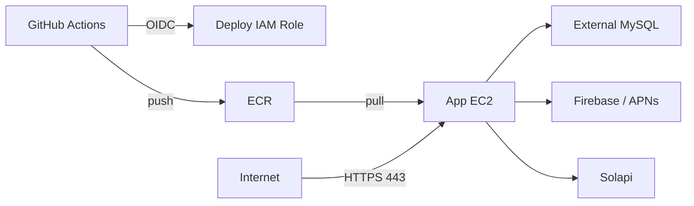

# Amazon Web Service (CloudFormation)

## 선택 이유

* 인프라는 CloudFormation으로 관리해 같은 환경을 반복 생성하고 변경 이력을 Git으로 추적한다.
* 현재 규모와 비용을 고려해 애플리케이션 서버를 퍼블릭 서브넷에 두고 Elastic IP를 할당한다.
* 컨테이너 이미지는 ECR에서 관리하고 GitHub Actions가 OIDC로 배포 역할을 위임받는다.
* 장기 Access Key를 저장하지 않으며, 배포 때 러너 IP의 SSH 접근만 일시 허용한 뒤 회수한다.

## 현재 운영 경로



애플리케이션은 별도 메시지 브로커 없이 Spring Modulith 이벤트 저장소와 MySQL의 `notification` 테이블로 발송 생애주기를 관리한다. CD는 앱 EC2, ECR, 보안 그룹, Elastic IP 관련 Output만 사용한다.

## 네트워크와 보안

* VPC: `10.50.0.0/16`
* Public Subnet: `10.50.1.0/24`
* 외부 인바운드: HTTPS `443/tcp`
* SSH `22/tcp`: CD 러너 IP에만 배포 중 일시 허용
* 애플리케이션 관리 포트는 외부에 공개하지 않는다.

## EC2와 ECR

| 리소스 | 기본값 | 용도 |
|---|---:|---|
| App EC2 | `t3.small` | `dsko`, `nginx`, `alloy` 실행 |
| ECR | `imhere/dsko` | 애플리케이션 이미지 보관 |

ECR은 push 시 스캔하고 최신 30개 이미지만 유지한다. EC2는 SSM의 최신 Amazon Linux 2023 AMI를 사용한다.

## CloudFormation 유예 범위

`infra/cloudformation/main.yaml`에는 이전 메시지 브로커용 인스턴스·보안 그룹·Output이 남아 있다. 애플리케이션과 CD 연결은 제거했지만, 운영 배포 안정화와 비용 확인 뒤 별도 인프라 변경으로 안전하게 폐기한다. 이 유예는 애플리케이션 코드가 해당 인프라를 사용한다는 뜻이 아니다.

## CD가 사용하는 Output

| Output | 용도 |
|---|---|
| `ElasticIp` | 앱 EC2 고정 IP |
| `Ec2InstanceId` | 앱 EC2 인스턴스 ID |
| `SecurityGroupId` | 배포 중 SSH 규칙 허용·회수 |
| `EcrRepositoryName` | ECR 로그인과 이미지 태그 |
| `EcrRepositoryUri` | 이미지 push/pull |
| `GitHubActionsRoleArn` | GitHub Actions OIDC 배포 역할 |

환경 변수 주입과 배포 순서는 [cicd.md](cicd.md), 실행 컨테이너 구성은 [docker.md](docker.md)를 참고한다.

## 사용 명령어

```bash
aws cloudformation deploy \
  --stack-name imhere-prod-infra \
  --template-file infra/cloudformation/main.yaml \
  --region ap-northeast-2 \
  --parameter-overrides \
    KeyName=imhere-prod-key \
    AppInstanceType=t3.small \
    EcrRepositoryName=imhere/dsko \
  --capabilities CAPABILITY_NAMED_IAM

aws cloudformation describe-stack-events \
  --stack-name imhere-prod-infra \
  --region ap-northeast-2
```
