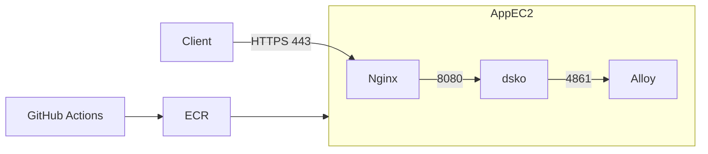

# Docker 구성

애플리케이션 이미지와 로컬·운영 Compose 구성을 설명한다. Nginx 세부 설정은 [nginx.md](nginx.md)를 참고한다.

## 구성 파일

| 파일 | 용도 |
|---|---|
| `Dockerfile` | 로컬 실행 및 이미지 검증 |
| `Dockerfile.release` | CI에서 만든 JAR의 운영 이미지 패키징 |
| `docker-compose.yml` | 로컬·운영 컨테이너 실행 |
| `infra/nginx/nginx.conf.template` | 운영 Nginx 설정 |
| `infra/alloy/alloy-config.alloy.template` | 운영 Alloy 설정 |

## 이미지 빌드

`Dockerfile`은 Gradle 빌드와 런타임을 분리한 멀티 스테이지 이미지다. `Dockerfile.release`는 CI에서 검증한 JAR만 복사하므로 운영 서버에서 Gradle 빌드를 반복하지 않는다.

```text
CI
  ├─ ./gradlew bootJar -x test
  ├─ Dockerfile.release 이미지 빌드
  └─ ECR push
```

## Compose 프로필

| Profile | 서비스 | 용도 |
|---|---|---|
| `local` | `app`, `prometheus`, `grafana` | 로컬 애플리케이션과 모니터링 |
| `prod` | `dsko`, `nginx`, `alloy` | 운영 애플리케이션 |

알림 이벤트 저장소와 발송 상태는 애플리케이션 DB를 사용하므로 별도 메시지 브로커 컨테이너가 필요하지 않다.

## 로컬 실행 구성

```bash
docker compose --profile local up -d

# 또는 애플리케이션을 직접 실행
./gradlew bootRun

./gradlew test
```

## 운영 실행 구성

```bash
docker compose --profile prod pull
docker compose --profile prod up -d
```

| 서비스 | 역할 |
|---|---|
| `dsko` | Spring Boot 애플리케이션 |
| `nginx` | HTTPS 진입점과 reverse proxy |
| `alloy` | 로그·메트릭·트레이스 수집 |

## 포트

| 포트 | 서비스 | 공개 범위 | 용도 |
|---:|---|---|---|
| `443` | Nginx | 외부 | HTTPS |
| `8080` | Spring Boot | 내부 | API |
| `4861` | Spring Boot Management | 내부 | Actuator |
| `9090` | Prometheus | 로컬 | 메트릭 수집 |
| `3000` | Grafana | 로컬 | 대시보드 |


