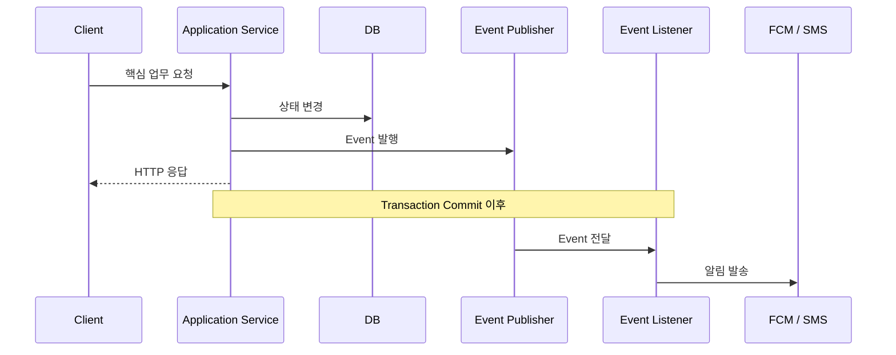
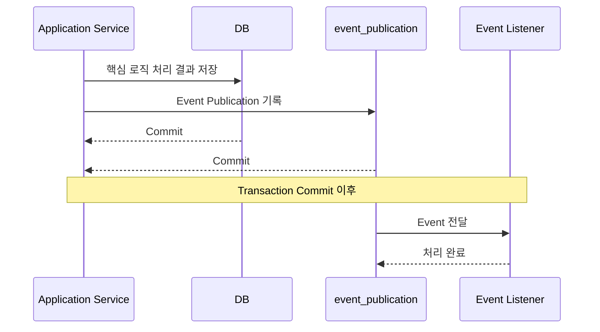

해당 문서는 `ImHere` 비동기와 메시징 관련된 내용을 다루고 있습니다.

- 어떤 작업을 비동기로 보내는지
- 비동기가 보장하는 레벨
- 비동기가 보장하지 못하는 것

---

# 비동기 처리 기준

### 비동기로 처리할 대상

- **핵심 업무 Transaction이 성공한 이후 수행할 수 있는가**
    - 핵심 업무보다 먼저 실행되면 안 되는 작업은 비동기로 분리하기 어렵다.
- **즉시 결과가 사용자 응답에 필요하지 않은가**
    - 결과가 필요하다면 결국 HTTP 응답이 해당 작업의 완료를 기다려야 한다.
- **외부 시스템의 지연이나 실패로부터 핵심 업무를 분리할 필요가 있는가**
    - 지연이나 실패를 분리할 필요가 없다면 비동기로 처리할 실익이 크지 않다.



### 비동기 시 해결 가능한 문제

- **응답 지연**
- **외부 요청 실패로 인한 롤백**
- **DB 커넥션 및 쓰레드 장기 점유**

### 비동기 처리 시 주의할 점

- **후속 작업이 실패해도 핵심 업무를 Rollback할 필요가 없어야 한다.**
    - 비동기 처리는 이미 핵심 업무 Transaction이 Commit된 이후 수행될 수 있다.
    - 따라서 후속 작업 실패 시 핵심 업무까지 되돌려야 한다면 비동기로 분리하면 안 된다.
- **실패를 기록하고 재처리할 수 있어야 한다.**
    - 비동기 작업은 요청 흐름 밖에서 실패할 수 있으므로 실패 상태를 추적할 방법이 필요하다.
    - 재시도나 복구 경로가 없다면 작업이 유실될 수 있다.

### 해당 서비스에서 비동기로 처리하는 작업

- `알림` 과 관련된 기능

**참고 사항**

- 핵심 상태가 저장되지 않았는데 알림부터 발송되는 상황을 허용하지 않는다.
    - 비동기 Listener는 **Transaction Commit 이후** 실행한다.
    - 업무 Transaction이 Rollback되면 해당 Event의 후속 알림도 처리하지 않는다.

# 비동기로 처리하지 않을 것

- 핵심 도메인 상태 변경
- 요청 성공 여부를 결정하는 검증
- 권한 검사
- 핵심 데이터 저장

# 비동기 처리 성공 기준

비동기 처리는 다음 두 가지를 만족해야 성공으로 본다.

- `Event`가 후속 처리까지 정상적으로 전달되었다.
- 실제 외부 작업의 결과가 시스템에 기록되었다.

### 현재 `ImHere` 의 알림

- **`PENDING`** : 알림이 등록되었지만 아직 발송되지 않은 상태다.
- **`PROCESSING`** : 하나의 실행 흐름이 발송 처리를 시작한 상태다.
- **`SENT`**
    - 외부 발송 성공이 시스템에 기록된 상태다.
    - 알림 처리의 최종 성공 상태다.
- **`FAILED`**
    - 발송 실패가 기록된 상태다.
    - 재처리 대상이 된다.
- **`UNKNOWN`**
    - 외부 발송 성공 여부를 확신할 수 없는 상태다.
    - 가능한 경우 `providerMessageId`를 이용해 실제 결과를 다시 확인한다.
- **`DEAD`**
    - 최대 시도 횟수를 초과한 상태
    - 자동 재시도를 중단하고 관리자 재처리 대상으로 남긴다.

**알림의 비동기 처리 성공 기준**

- `SENT` 상태가 저장되었다.
- 실패한 작업도 유실되지 않고,  `FAILED`, `UNKNOWN`, `DEAD` 상태로 기록하여 추적이 가능하다

# 비동기 작업

#### 현재 채택 방법

- `Spring Modulith` 의 `event_publication` 사용



## 비동기 작업 보장 범위

**현재 채택한 방식**

- `Spring Modulith`의 `Event Publication Registry`
    - 핵심 로직과 `Event Publication`은 같은 Transaction 흐름에서 관리

**보장 수준**

- **핵심 로직과 Event 전달 사이의 소실 가능성을 줄이고 재처리 가능성을 제공**
- **외부 Provider까지 포함한 Exactly Once는 보장하지 않음.**

**동작**

- `Transaction`이 `Commit`된 이후에만 `Listener`를 실행
    - 핵심 로직 Transaction이 Rollback되면 Listener를 실행하지 않음.
- `Commit` 이후 `Listener`가 정상 처리되지 않으면 `미완료 Publication`을 남긴다.
- 미완료 Event는 애플리케이션 재시작 이후 다시 발행하여 재처리할 수 있도록 한다.

    ```yaml
    # application.yaml:39
    spring:
      modulith:
        events:
          completion-mode: delete
          republish-outstanding-events-on-restart: true
    ```

# 중복 및 실패 처리

1. 동일 Event의 Notification 중복 생성 :  **`dedupe_key(**eventId + notificationMethod)` 와 DB `UNIQUE` 제약으로 방지
2. 동일 Notification의 동시 발송 : `PENDING / FAILED → PROCESSING` 조건부 UPDATE로 하나의 실행 흐름만 처리하도록 하였음
3. 재시도 가능한 Provider 오류는 `Spring Retry`로 최대 3회 재시도한다.
4. 처리되지 않은 `PENDING`, 오래된 `PROCESSING`, `FAILED`, `UNKNOWN`은 Recovery Scheduler가 다시 처리한다.
5. 반복 실패는 `DEAD` 상태로 전환하여 자동 재시도를 중단하고 관리자 재처리 대상으로 남긴다.
6. Provider 발송 여부를 확신할 수 없는 경우 `UNKNOWN`으로 기록하고, 가능한 경우 `providerMessageId`로 실제 결과를 확인한다.

# 한계

- **Event 재처리와 DB 기반 중복 방지는 지원하지만, 외부 Provider까지 포함한 Exactly Once는 보장하지 못한다.**

## 이유

- **외부 Provider 호출과 DB 상태 저장을 하나의 Transaction으로 묶을 수 없다.**
    - Provider 발송 성공 후 `SENT` 저장 전에 장애가 발생하면 실제 발송 결과와 내부 상태가 달라질 수 있다.
    - 이후 재처리 과정에서 동일 알림이 중복 발송될 가능성이 있다.

        ```mermaid
        sequenceDiagram
            participant App as Application Service
            participant DB
            participant Provider as FCM / SMS
        
            App->>DB: PROCESSING 저장
            DB-->>App: Transaction A Commit
        
            App->>Provider: 외부 발송 요청
            Provider-->>App: 발송 결과 반환
        
            App->>DB: SENT 저장
            DB-->>App: Transaction B Commit
        ```

- **`dedupe_key`는 Notification 중복 생성을 막지만 Provider 호출 자체의 중복까지 막지는 못한다.**
    - 동일 Event로 Notification Row가 여러 개 생성되는 것은 DB `UNIQUE` 제약으로 방지한다.
    - 하지만 Provider 호출 이후 프로세스가 종료되면 Recovery 과정에서 동일 Provider 호출이 다시 발생할 수 있다.
- **Kafka / RabbitMQ 같은 외부 Broker 수준의 전달·복구 기능이 없다.**
    - 현재 Kafka나 RabbitMQ를 사용하지 않으므로 Consumer Group, Partition, ACK/NACK, Redelivery, DLQ 같은 Broker 기능을 사용하지 않는다.
    - Event 전달 실패는 Spring Modulith의 `event_publication`, 알림 발송 실패는 Notification Recovery Scheduler가 각각 재처리한다.

## 추후 고려할 점

**현재**

- 별도 Broker를 운영하는 복잡도 때문에 **`Spring Modulith + DB 기반 중복 방지 + Retry/Recovery**` 구조를 채택함

**고려 조건**

- 사용자와 처리량이 증가
- 다중 인스턴스 운영이 필요해진 경우

**고려할 점**

- RabbitMQ 등 외부 Broker 도입
- DLQ를 통한 반복 실패 작업 격리
- 별도 멱등성 저장소 도입
- Provider 중복 호출 방지 강화
- 재시도 정책 통합
