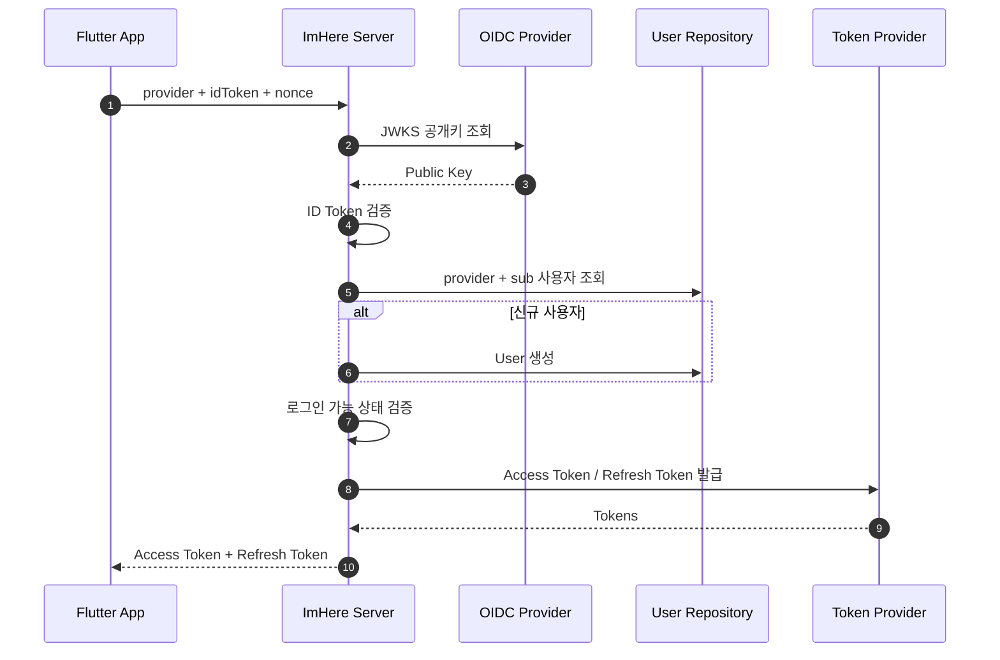
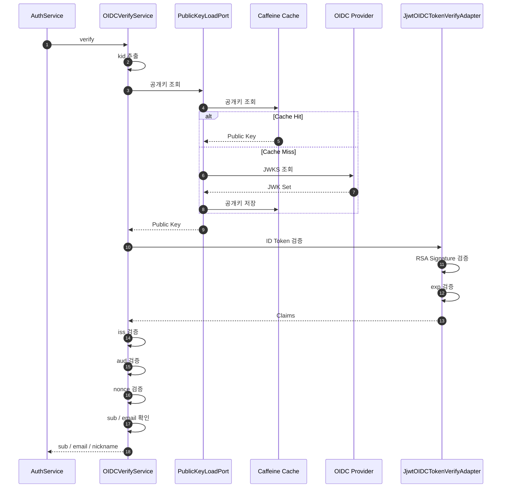
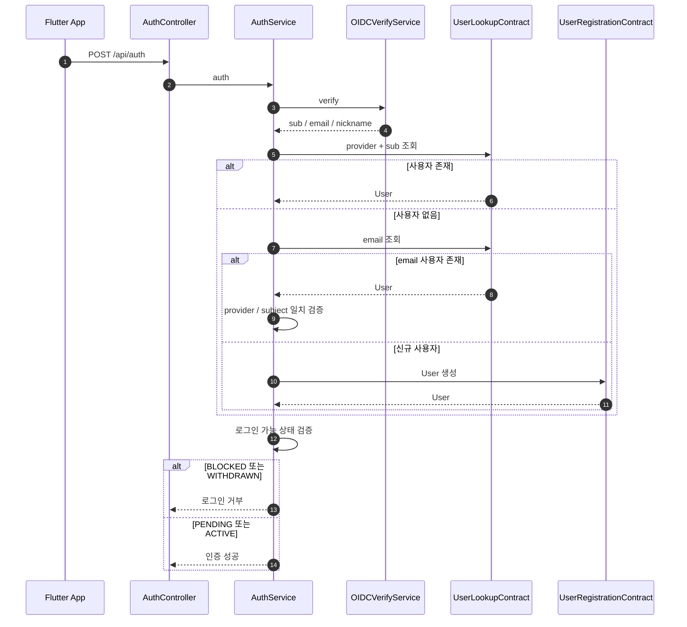
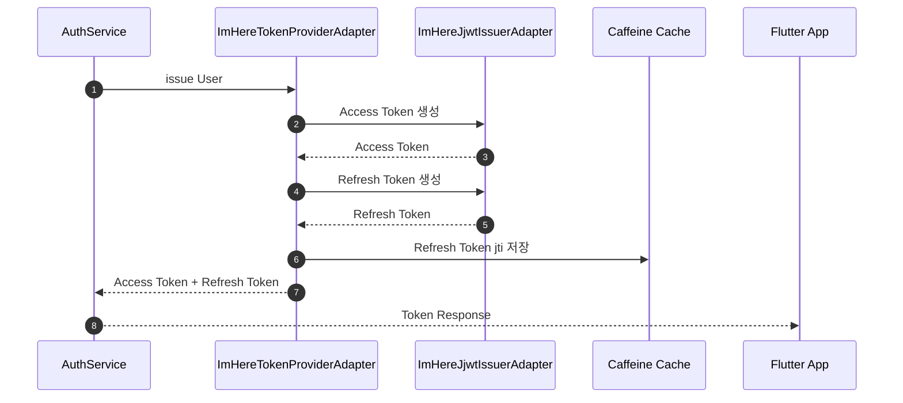
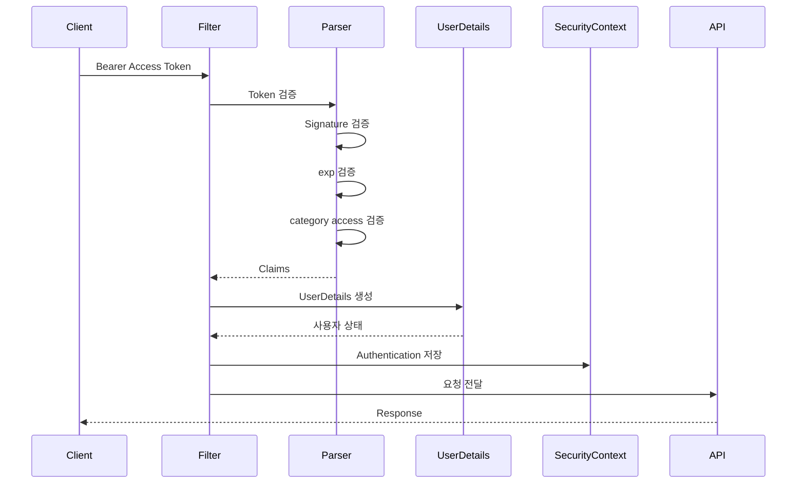
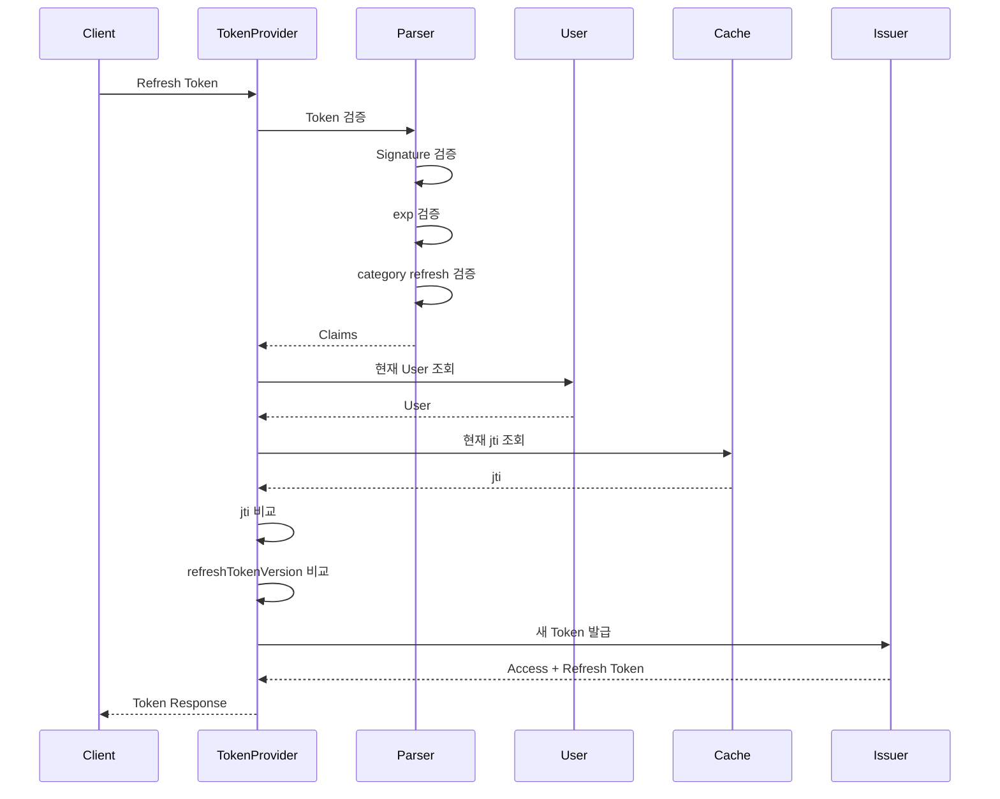
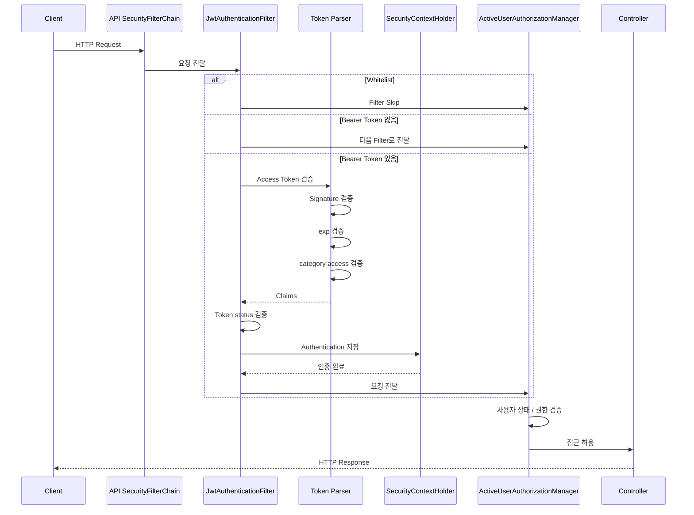

# Security

- `ImHere`의 인증·인가 구조를 설명합니다.
- 주요 인증 방식
    - 일반 사용자
        - 인증 및 인가 : `OIDC` + ImHere 자체 `JWT`
    - 관리자
        - 인증 : ID / Password + TOTP + `HttpSession`
        - 인가: ImHere 자체 `JWT` + `ROLE_ADMIN`

---

# OpenID Connect

- **일반 사용자 인증은 OIDC 기반 OAuth 인증을 사용합니다.**
    - 지원 Provider
        - `Kakao`
        - `Google`
        - `Apple`
            - `aud`가 플랫폼마다 다릅니다. iOS 네이티브 로그인은 앱의 `Bundle ID`, 웹은 `Services ID`가 들어오므로
              `APPLE_CLIENT_ID`(Bundle ID)와 `APPLE_SERVICE_ID`(Services ID)를 **둘 다** 채워야 합니다.
            - 값이 비면 `OIDCProperties`가 빈 문자열을 걸러내 허용 `aud` 목록이 비고, Apple 로그인만 `AUTH-101`로 실패합니다.
- 클라이언트가 `Authorization Code`를 전달하는 방식이 아니라, Provider가 발급한 `ID Token`을 서버에 전달합니다.

## 전체 인증 흐름

- **하나의 인증 Endpoint에서 기존 사용자 로그인과 신규 사용자 가입을 함께 처리합니다.**



1. Flutter App이 `provider`, `idToken`, `nonce`를 전달합니다.
2. 서버가 Provider의 JWKS 공개키로 ID Token을 검증합니다.
3. `(provider, sub)` 조합으로 사용자를 식별합니다.

- 해당 조합의 기존 사용자가 없으면 신규 User 생성

4. 로그인 가능 상태를 확인합니다.

- `PENDING`, `ACTIVE` : 허용
- `BLOCKED`, `WITHDRAWN` : 거부

5. 인증 성공 시 ImHere 자체 Access / Refresh Token을 발급합니다.

## OIDC 검증

- **Provider의 JWKS 공개키를 이용해 ID Token의 신뢰성을 검증합니다.**
    - ID Token Header의 `kid`로 공개키 식별
    - `Caffeine Cache` 우선 조회
    - Cache Miss 시 Provider의 `JWKS URI` 조회
    - RSA Signature 및 `exp` 검증
    - `iss`, `aud`, `nonce` 검증
    - `sub`, `email` 존재 여부 확인

### Provider별 특이사항

- **`nonce`는 원문과 SHA-256 해시를 모두 허용합니다.** (`OidcNoncePolicy`)
    - `nonce`는 같은 ID Token을 가로채 다시 쓰는 replay 공격을 막으려고 클라이언트가 만들어 보내는 일회성 난수입니다.
    - `Kakao`, `Google`은 클라이언트가 준 값을 그대로 ID Token에 담습니다.
    - `Apple`은 인가 요청에 원문이 아니라 `sha256(rawNonce)`를 싣는 것이 표준 흐름이라, ID Token에는 해시값이 들어옵니다.
    - 그래서 서버는 `원문 일치` 또는 `SHA-256 hex 일치` 중 하나만 맞으면 통과시킵니다. 둘 다 아니면 `AUTH-109`입니다.
- **`Apple`은 `email`이 없어도 가입을 이어 갑니다.** (`OidcEmailPolicy`)
    - `Apple`은 사용자가 email scope를 주지 않으면 ID Token에 `email` 클레임 자체를 넣지 않습니다.
    - `users.email`이 `NOT NULL` + `UNIQUE`라 값이 반드시 필요하므로, `apple_{sub}@noreply.imhere.invalid` 형태의
      배달 불가 주소를 만들어 씁니다. `.invalid`는 RFC 2606이 "실제로 존재하지 않는 도메인"으로 예약해 둔 TLD입니다.
    - `sub`는 Provider 안에서 바뀌지 않는 식별자라, 재로그인해도 같은 주소가 나옵니다.
    - `email`도 `sub`도 없으면 만들 근거가 없으므로 `AUTH-103`으로 거절합니다.
    - `Kakao`, `Google`은 `email`을 항상 주므로 누락이면 그대로 거절합니다.
- **`exp` 검증에 60초의 시계 오차를 허용합니다.** (`JjwtOIDCTokenVerifyAdapter.CLOCK_SKEW_SECONDS`)
    - `Apple` ID Token의 수명은 10분으로 `Google`(1시간), `Kakao`(12시간)보다 훨씬 짧습니다.
    - 서버 시계가 조금만 앞서 있어도 `Apple` 로그인만 `AUTH-100`(만료)으로 떨어지기 때문입니다.
- **JWKS 조회 실패는 `WARN` 로그로 남습니다.** (`OidcPublicKeyClient`)
    - 조회에 실패하면 호출부에는 "공개키를 못 찾았다"라는 결과만 남아 원인을 알 수 없습니다.
    - 그래서 실패 원인과 `jwksUri`를 로그로 남기고, 한 Provider의 실패가 다른 Provider의 갱신이나
      애플리케이션 기동을 막지 않도록 `OauthPublicKeyService.fetchAll()`에서 Provider 단위로 격리합니다.



### 검증 항목

| 항목      | 검증 기준                                     |
|---------|-------------------------------------------|
| `iss`   | Provider에 설정된 허용 issuer 중 하나와 일치          |
| `aud`   | ID Token audience와 설정된 audience가 하나 이상 일치 |
| `exp`   | JJWT signed-claims 파싱 과정에서 만료 여부 검증       |
| `nonce` | 요청 nonce가 비어 있지 않고 Token의 nonce와 일치       |
| `sub`   | `AuthService`에서 null이면 거부                 |
| `email` | 사용자 정보 반환 전 필수 존재                         |
| `iat`   | 별도의 존재 여부·시간 범위 검증 없음                     |

### Provider 설정

```yaml
oidc:
  providers:
    kakao:
      issuers:
        - https://kauth.kakao.com
      jwks-uri: https://kauth.kakao.com/.well-known/jwks.json
      audiences:
        - ${KAKAO_CLIENT_ID}

    google:
      issuers:
        - https://accounts.google.com
        - accounts.google.com
      jwks-uri: https://www.googleapis.com/oauth2/v3/certs
      audiences:
        - ${GOOGLE_CLIENT_ID_WEB}
        - ${GOOGLE_CLIENT_ID_IOS}
        - ${GOOGLE_CLIENT_ID_ANDROID}
```

## 사용자 인증

- **검증된 OIDC 식별자를 기준으로 기존 사용자를 찾고 로그인 가능 여부를 판단합니다.**
    - `(provider, sub)` 조합으로 조회
    - 해당 조합의 사용자가 없으면 신규 User 생성



### 사용자 식별 기준

- **기본 식별 기준 : `(provider, sub)` 조합**
    - `findByOidcIdentityOrNull(provider, sub)` 호출
    - 조회 결과가 없으면 신규 User 생성
- email
    - ID Token의 필수 사용자 정보
    - 사용자 식별이나 기존 계정 fallback 조회에는 사용하지 않음
- 인증 서비스의 조회 기준과 DB의 UNIQUE 제약은 별개로 관리

---

## 자체 Token 발급

- **OIDC 인증 완료 후 ImHere 자체 Access Token과 Refresh Token을 발급합니다.**
    - `category` Claim으로 Token 용도 구분
    - 사용자 식별 정보·권한·상태 포함
    - `refreshTokenVersion` 포함
    - Refresh Token의 `jti`를 Caffeine Cache에 저장



---

# ImHere JWT Token

- **OIDC를 이용해 사용자의 외부 신원을 검증 후 ImHere API 인증·인가는 자체 JWT를 사용합니다.**
- Token은 Claim의 `category`로 용도를 구분합니다.
    - Access Token : `category = access`
    - Refresh Token : `category = refresh`

## Access Token

- **인가가 필요한 API의 Bearer 인증에 사용합니다.**

### Claim

- `category = access`
- `uid`
- `email`
- `nickname`
- `role`
- `status`
- `refreshTokenVersion`
- `iat`
- `exp`
- `jti`

### 검증

- **Access Token은 서명·만료·용도를 검증한 뒤 Spring Security 인증으로 변환합니다.**
    - JWT Secret 기반 Signature 검증
    - `exp` 검증
    - `category = access` 검증
    - Claim 기반 `ImHereUserDetails` 생성
    - `status` Claim 기반 계정 상태 확인
    - 성공 시 `SecurityContextHolder`에 Authentication 저장



- Refresh Token은 `category = refresh`이므로 Access Token 파싱 경로에서 거부됩니다.
- Access Token 인증 시 User를 DB에서 다시 조회하지 않습니다.
- 현재 사용자 상태는 Access Token에 저장된 `status` Claim을 기준으로 판단합니다.

## Refresh Token

- **Access Token과 Refresh Token을 새로 발급받는 용도로만 사용합니다.**

### Claim

- Access Token과 동일한 사용자 관련 Claim 사용
- `category = refresh`
- `jti`를 현재 Refresh Token 식별자로 사용

### 검증

- **JWT 자체 검증뿐 아니라 현재 User와 서버의 Refresh Token 상태를 함께 확인합니다.**
    - Signature 검증
    - `exp` 검증
    - `category = refresh` 검증
    - Token의 email로 현재 User 조회
    - Token `jti`와 Caffeine Cache의 현재 `jti` 비교
    - Token의 `refreshTokenVersion`과 User의 현재 Version 비교



### Refresh Token 재발급

- 새 Refresh Token의 `jti` 발급
- Cache의 기존 `jti`를 새 `jti`로 교체
- 이전 Refresh Token의 `jti`는 이후 검증에서 불일치
- 이전 Refresh Token 재사용 차단

## Token 만료 정책

- `Access Token` : 기본 `720분`
    - 속성 : `jwt.access-expiration-minutes`
    - 테스트 값 : `10분`
- `Refresh Token` : 기본 `7일`
    - 속성 : `jwt.refresh-expiration-days`
    - 테스트 값 : `2일`
- `관리자 Access Token` : 기본 `15분`
    - 속성 : `jwt.admin-expiration-minutes`
    - 테스트 값 : `5분`
- `발급 시각`
    - `JJWT .issuedAt(Date.from(Instant.now()))`
- `만료 시각`
    - 현재 시각 + Token TTL
- `Clock Skew`
    - 별도 설정 없음

---

## JWT Secret

- **자체 JWT Signature Key는 운영 환경에서 환경 변수로 주입합니다.**
    - 환경 변수 : `JWT_SECRET`
    - 운영 환경 : `${JWT_SECRET}` 필수
    - 로컬 환경 : 개발용 fallback 사용 가능

---

# 계정 상태 별 Token 처리

| 상태          | 새 로그인 | Access Token                  | Refresh Token            |
|-------------|-------|-------------------------------|--------------------------|
| `PENDING`   | 가능    | 일부 API만 접근 가능                 | 재발급 가능                   |
| `ACTIVE`    | 가능    | 사용 가능                         | 재발급 가능                   |
| `BLOCKED`   | 거부    | 기존 ACTIVE Token은 만료 전까지 사용 가능 | Version 증가 후 기존 Token 거부 |
| `WITHDRAWN` | 거부    | 기존 ACTIVE Token은 만료 전까지 사용 가능 | Version 증가 후 기존 Token 거부 |

### 강제 로그아웃

- `refreshTokenVersion`을 증가시켜 기존 Refresh Token 폐기
- `Access Token` 은 즉시 폐기하지 않음.
    - 만료 전까지 유효할 수 있음

# 요청 인증 흐름



- 주요 Whitelist
    - `/api/auth`
    - `/api/auth/refresh`
    - `/api/terms`
    - Swagger / API Docs
    - Management Base Path
- 나머지 API
    - 기본 `authenticated()`
- 관리자 API
    - 별도 Filter Chain 적용
    - `ROLE_ADMIN` 요구

---

# 관리자 API 보호

- `/api/admin/**`는 `ROLE_ADMIN`만 접근할 수 있습니다.
    - 미인증 : `401 Unauthorized`
    - 일반 사용자 : `403 Forbidden`

---

# CORS

- `/api/**`에 대해 허용 Origin, Method, Header를 명시적으로 제한합니다.
    - Origin : `CORS_ALLOWED_ORIGINS`
    - Method : `GET`, `POST`, `PUT`, `DELETE`, `PATCH`, `OPTIONS`
    - Header : `Authorization`, `Content-Type`, `X-Requested-With`
    - Credentials : `false`
- Preflight 요청은 `OPTIONS /**`를 허용합니다.
- 운영·테스트 환경의 Origin은 환경 설정으로 주입합니다.

---

# 현재 한계

- **차단·탈퇴 이후 기존 Access Token은 즉시 폐기되지 않음**
    - 요청마다 DB의 현재 User 상태를 조회하지 않음
    - 기존 `status = ACTIVE` Claim을 신뢰함
- **Refresh Token 폐기는 이벤트 처리 이후 적용됨**
    - 상태 변경과 `refreshTokenVersion` 증가 사이에 시간 차이가 존재할 수 있음
- **Refresh Token Rotation은 로컬 Caffeine Cache에 의존함**
    - Application 재시작 시 상태가 초기화됨
    - 다중 인스턴스 간 상태가 공유되지 않음
- **Refresh 재발급 시 BLOCKED / WITHDRAWN 상태를 직접 검사하지 않음**
    - 현재 차단은 `refreshTokenVersion` 변경에 의존함
